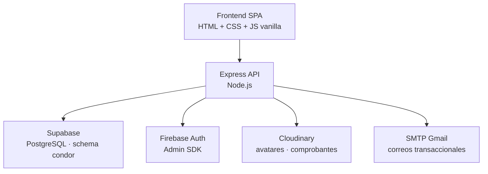

# SGI El Cóndor — Sistema de Gestión Inmobiliaria


SGI El Cóndor es una plataforma web diseñada para centralizar y automatizar los procesos comerciales, financieros y operativos de una empresa inmobiliaria. El sistema integra gestión de proyectos, ventas, cartera, pagos, facturación, conciliación bancaria y seguimiento jurídico dentro de una única aplicación.

---

## Descripción

**SGI El Cóndor** digitaliza y centraliza el ciclo completo de venta de lotes de la inmobiliaria El Cóndor S.A.S.:

- Catálogo público de proyectos y lotes, accesible sin autenticación.
- Registro de ventas con uno o varios compradores, porcentajes de participación, permutas y plan de pago auto-generado.
- Cadena documental factura → pago → recibo con numeración consecutiva trazable.
- Conciliación de pagos contra extractos bancarios con cruce automático por monto, referencia y fecha.
- Cálculo y causación automática de comisiones al alcanzar el 30 % del valor de la venta.
- Seguimiento jurídico de cartera en pre-mora y mora, con bitácora de observaciones.
- Portal personal del comprador (Mis Cuotas, Mis Facturas, Mis Pagos, Mis Recibos) con carga de comprobantes.
- Gestión granular de permisos editable en caliente por el administrador.
- Bitácora de auditoría en cada cambio de estado, pago, devolución o ajuste sensible.

---

## Características

- Gestión de proyectos urbanísticos y lotes
- Registro de ventas con múltiples compradores y porcentajes de participación
- Generación automática de planes de cuotas (iniciales + regulares + fracciones)
- Facturación y emisión de recibos numerados
- Conciliación bancaria automática por monto, referencia y fecha
- Control de cartera: pre-mora, mora y devoluciones
- Cálculo automático de comisiones (umbral 30 %)
- Portal del comprador con carga de comprobantes
- Promoción automática a rol `comprador` en la primera venta
- Manual de funciones consultable por cada rol desde el menú de usuario
- Sistema de roles y permisos configurable en caliente
- Auditoría obligatoria de cambios críticos
- Reportes ejecutivos: cartera, recaudo, comisiones, proyección de ingresos

---

## Tecnologías

| Capa             | Tecnología                                                  |
| ---------------- | ----------------------------------------------------------- |
| Runtime          | Node.js 20+                                                 |
| Framework HTTP   | Express 4                                                   |
| Base de datos    | Supabase (PostgreSQL) — schema `condor`                     |
| Autenticación    | Firebase Auth (cliente) + Firebase Admin SDK + JWT          |
| Almacenamiento   | Cloudinary (avatares y comprobantes de pago)                |
| Correo           | Nodemailer + SMTP de Gmail                                  |
| Frontend         | HTML + CSS + JavaScript vanilla (SPA, sin framework)        |
| Build producción | esbuild 0.28 (concat + bundle ESM + content hash)           |
| Tests            | Jest 30                                                     |
| Dev experience   | nodemon + livereload                                        |

---

## Puesta en marcha

### Requisitos previos

- **Node.js 20** o superior.
- Cuenta **Supabase** con el schema `condor` aprovisionado (tablas, vistas y funciones `next_consecutivo_condor`, `actualizar_mora`).
- Proyecto **Firebase** con Authentication habilitado (Email/Password + Google) y cuenta de servicio para el Admin SDK.
- Cuenta **Cloudinary** para avatares (5 MB máx) y comprobantes de pago (8 MB máx).
- Cuenta SMTP de Gmail con App Password para correos transaccionales (opcional).

### Instalación

```bash
git clone https://github.com/sgi-elcondor/sgi.git
cd sgi
npm install
cp .env.example .env   # completar con las credenciales reales
npm run dev
```

El servidor arranca en `http://localhost:3000` con livereload activo.

### Variables de entorno

Renombrar `.env.example` a `.env` y completar cada valor. Las variables obligatorias son `SUPABASE_URL`, `SUPABASE_SERVICE_KEY` y las de Firebase. El resto tiene defaults o es opcional.

Ver `.env.example` para la lista completa con comentarios.

### Comandos disponibles

| Comando               | Descripción                                                           |
| --------------------- | --------------------------------------------------------------------- |
| `npm run dev`         | Servidor de desarrollo con nodemon + livereload (puerto 3000)         |
| `npm start`           | Servidor de producción                                                |
| `npm run build`       | Genera `public/dist/*.min.{js,css}` y `public/index.prod.html`        |
| `npm run build:watch` | Build incremental al cambiar `public/js`, `public/css` o `index.html` |
| `npm test`            | Suite Jest                                                            |

---

## Estructura del repositorio

```
src/
├── index.js            Entry point Express, mounting, mora cron
├── config/             Clientes externos y mapa de permisos (permissions.js)
├── middlewares/        verificarToken + verificarPermiso
├── controllers/        Lógica HTTP por dominio (uno por entidad)
├── routes/             Mapeo de URLs a controllers
└── services/           Lógica compartida: cuotas, recibos, mora, comisiones,
                        consecutivos, saldos, role-promotion, email, auditoría

public/
├── index.html          SPA principal (dev, scripts sueltos con livereload)
├── index.prod.html     Generado por build.mjs (assets hasheados)
├── login.html · proyectos.html · reset-password.html
├── js/
│   ├── app.js          Router hash-based, VIEWS map, tema
│   ├── api.js          Cliente HTTP con caché y refresh de token
│   ├── auth.js         Bridge Firebase Web SDK
│   ├── state.js        AppState (vistas activas + permisos)
│   ├── helpers.js      SGIHelpers + SGISearch
│   ├── components/     sidebar, user-menu, onboarding, role-switcher, etc.
│   └── views/          Módulos por dominio (operacion, finanzas, control,
│                       juridico, mi-cuenta)
└── css/
    ├── base/           tokens, reset, global
    ├── components/     botones, modales, tablas, formularios, etc.
    ├── layout/         sidebar, topbar, containers
    ├── views/          estilos por vista
    └── responsive.css  Cargado siempre al último

tests/                  Pruebas unitarias Jest sobre los services críticos
seeds/                  Scripts de seed y validación end-to-end
docs/                   Documentación complementaria
build.mjs               Build de producción
```

---

## Arquitectura

### Diagrama de servicios



### Flujo de un request

```
HTTP request
  │
  ├── GET /                    → landing pública (proyectos.html)
  ├── /dist/*                  → assets hasheados (Cache-Control: immutable, 1 año)
  ├── /api/v1/auth/*           → endpoints sin verificarToken
  ├── /api/v1/public/*         → catálogo público (sin token)
  ├── /api/v1/firebase-config  → configuración pública del cliente Firebase
  ├── /api/v1/*                → verificarToken + verificarPermiso → router del recurso
  └── *                        → SPA wildcard (index.html / index.prod.html)
```

### Autenticación y permisos

- **`verificarToken`** valida el ID token de Firebase, resuelve la identidad en `condor.usuarios` y cachea el resultado 60 s en memoria. Si el usuario no existe, auto-aprovisiona una fila con rol `usuario` por defecto.
- **`verificarPermiso`** consulta `src/config/permissions.js` con la clave `MÉTODO /api/v1/ruta`. El rol `admin` hace bypass total.

---

## Modelo de roles

| Rol                 | Propósito                                                                 |
| ------------------- | ------------------------------------------------------------------------- |
| `admin`             | Acceso total (bypass del middleware de permisos).                         |
| `usuario`           | Rol por defecto al registrarse. Solo catálogo público.                    |
| `comprador`         | Cliente con venta activa. Portal personal (cuotas, facturas, pagos).      |
| `asesor_comercial`  | Comercial de campo. Crea solicitudes de venta pendientes de autorización. |
| `auxiliar_contable` | Operación financiera completa: ventas, pagos, facturas, recibos, ajustes. |
| `gerencia`          | Lectura de reportes consolidados y dashboards directivos.                 |
| `juridico`          | Seguimiento de cartera en mora y procesos de devolución.                  |
| `comisionista`      | Visualiza sus comisiones causadas y micropagos recibidos.                 |
| `auditoria`         | Supervisión de la trazabilidad de cambios críticos.                       |

Cada usuario consulta el detalle de su rol (funciones, obligaciones y acciones permitidas) desde el ítem **Mi rol** en el menú del avatar.

---

## API HTTP

Todos los endpoints autenticados van bajo `/api/v1/*`. Resumen por dominio:

| Dominio               | Endpoints principales                                                                |
| --------------------- | ------------------------------------------------------------------------------------ |
| Auth                  | `GET /auth/perfil`, `GET /auth/mi-rol`, `POST /auth/vincular`                        |
| Catálogo público      | `GET /public/proyectos`, `GET /public/lotes`, `GET /public/asesores`                 |
| Proyectos / Lotes     | CRUD sobre `/proyectos`, `/lotes`, `/lotes/disponibles`                              |
| Ventas                | `/ventas`, `/ventas/solicitud`, `/ventas/estado-financiero`, `/ventas/mis-ventas`    |
| Cuotas                | `/cuotas/pendientes`, `/cuotas/vencidas`, `/cuotas/venta/:id/plan`                   |
| Pagos                 | `/pagos`, `/pagos/comprador`, `/pagos/contrast`, `/pagos/accept-batch`               |
| Facturas / Recibos    | `/facturas`, `/facturas/solicitar`, `/recibos`, `/recibos/generar-pendientes`        |
| Comisionistas         | `/comisionistas`, `/comisionistas/comisiones`, `/comisionistas/ventas/:id/micropago` |
| Reportes              | `/reportes/panel`, `/reportes/cartera-hoy`, `/reportes/proyeccion-ingresos`          |
| Conciliación bancaria | `/bank-transactions`, `/bank-transactions/batch`                                     |
| Jurídico              | `/juridico/cartera`, `/juridico/observaciones`                                       |
| Gastos / Recepciones  | `/gastos`, `/gastos/resumen`, `/recepciones`, `/recepciones/pendientes`              |
| Usuarios / Roles      | `/usuarios`, `/roles`, `/roles/:id/permisos`, `/roles/:id/manual`                    |
| Portal del comprador  | `/pagos/mis-pagos`, `/facturas/mis-facturas`, `/recibos/mis-recibos`                 |
| Uploads               | `/uploads/baucher`, `/uploads/avatar`                                                |

Mapa completo y permisos asociados: [`src/config/permissions.js`](src/config/permissions.js).

---

## Build de producción

```bash
npm run build
NODE_ENV=production npm start
```

`build.mjs` realiza:

1. Concatenación y minificación de los scripts clásicos → `sgi.min.js`.
2. Bundle ESM de `app.js` + `auth.js` → `app.min.js`.
3. Resolución de `@imports` CSS + append de `comprador.css` y `responsive.css` → `sgi.min.css`.
4. Hash de contenido (8 caracteres) en cada bundle para invalidación de caché.
5. Generación de `public/index.prod.html` con las referencias hasheadas.

Los assets bajo `/dist/*` se sirven con `Cache-Control: immutable, max-age=1y`.

---

## Testing

```bash
npm test
```

Suite Jest con cobertura unitaria sobre los services críticos:

| Service                  | Qué cubre                                               |
| ------------------------ | ------------------------------------------------------- |
| `cuotas.service`         | Generación del plan de pago, suma de meses, rollback    |
| `consecutivos.service`   | Numeración de pagos, recibos y micropagos               |
| `recibos.service`        | Idempotencia y manejo de recibos huérfanos              |
| `saldos.service`         | Fórmula canónica de saldo y clasificación de mora       |
| `auth-cache.service`     | TTL e invalidación de caché de identidad                |
| `usuarios.service`       | Verificación de compradores inactivos                   |
| `role-promotion.service` | Auto-promoción a comprador en primera venta             |

Scripts de validación y carga de datos de desarrollo:

```bash
node seeds/seed.js                  # seed completo
node seeds/seed-manual-roles.js     # pobla el manual de roles
node seeds/validate-promotion.js    # valida la promoción automática contra BD real
```

---

## Capturas de pantalla

> Las capturas se irán agregando en `docs/images/` a medida que el proyecto avance.

| Vista | |
|-------|-|
| Dashboard directivo | `docs/images/dashboard.png` |
| Gestión de ventas | `docs/images/ventas.png` |
| Portal del comprador | `docs/images/portal-comprador.png` |

---

## Flujo de trabajo Git

```
main          ← merge al cerrar Sprint (PR revisado por el equipo)
  └── develop ← integración continua
        ├── feat/<historia>
        ├── fix/<descripcion>
        └── hotfix/<corto>
```

Convención de commits: `feat:`, `fix:`, `refactor:`, `docs:`, `chore:`, `style:`. Cada Pull Request va dirigido a `develop`. El merge a `main` ocurre solo al cerrar un Sprint.

---

## Documentación adicional

| Documento | Contenido |
| --------- | --------- |
| [`CLAUDE.md`](CLAUDE.md) | Contexto extendido: reglas de negocio (RN-01…RN-23), flujos críticos paso a paso, áreas sensibles, dependencias críticas y convenciones |
| [`docs/business-rules.md`](docs/business-rules.md) | Reglas de negocio detalladas, invariantes y consecutivos |
| [`docs/project-management.md`](docs/project-management.md) | Stakeholders, planificación de sprints, definición de READY/DONE, análisis de costo |
| [`docs/team.md`](docs/team.md) | Equipo de desarrollo |
| [`src/config/permissions.js`](src/config/permissions.js) | Mapa exhaustivo de permisos por endpoint |
| [`tests/`](tests/) | Comportamiento esperado de los services del backend |
| [`seeds/`](seeds/) | Datos de desarrollo y scripts de validación reproducibles |

---

## Licencia

Proyecto académico desarrollado en la **Universidad Nacional de Colombia** para El Cóndor S.A.S. Todos los derechos reservados.
