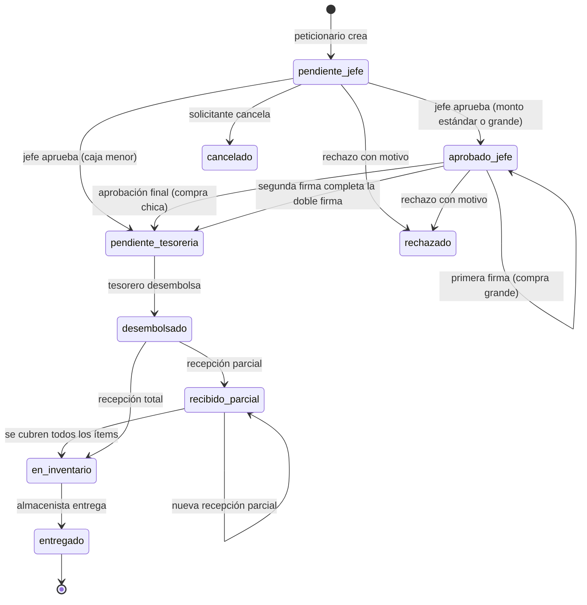
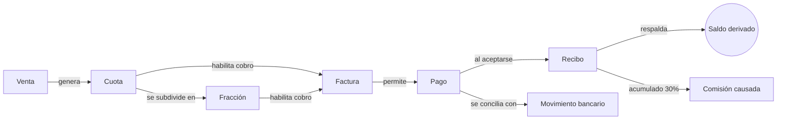

# Documento Funcional

## Sistema de Gestión Inmobiliaria SGI El Cóndor

**Versión 1.0 — Entrega final**

Preparado para **El Cóndor S. A. S.**

Elaborado por el equipo de desarrollo del SGI:
Juan Manuel Candela Toro, Jabes Esteban Monroy Becerra,
Juan David Barco Ruiz y Juan Manuel Díaz Gómez

29 de julio de 2026

---

### Control del documento

| Campo | Valor |
|---|---|
| Código | SGI-DOC-FUN-01 |
| Versión | 1.0 |
| Fecha de emisión | 29 de julio de 2026 |
| Estado | Emitido para entrega |
| Clasificación | Uso interno de El Cóndor S. A. S. |
| Elaborado por | Equipo de desarrollo del SGI |
| Revisado por | Product Owner (J. E. Monroy Becerra) |
| Aprobado por | Pendiente de aceptación del área usuaria |
| Documentos relacionados | SGI-DOC-ARQ-01, SGI-DOC-DAT-01 |

---

> **Nota sobre el formato.** Este documento aplica las convenciones de la séptima
> edición del manual de estilo APA (American Psychological Association, 2020) para
> la numeración y titulación de tablas y figuras, las citas en el texto y la lista
> de referencias, con el fin de que toda fuente técnica invocada sea verificable
> por el lector.

---

## Resumen

El presente documento especifica el comportamiento funcional del Sistema de
Gestión Inmobiliaria SGI El Cóndor, una plataforma web interna desarrollada para
la inmobiliaria El Cóndor S. A. S. con el propósito de digitalizar la venta de
lotes y la totalidad de su ciclo financiero asociado. El sistema cubre el
catálogo de proyectos urbanísticos, el registro de ventas con múltiples
compradores, la generación automática del plan de pago, la facturación, el
registro y validación de pagos contra extractos bancarios, la emisión de recibos
numerados, la liquidación de comisiones, el seguimiento jurídico de la cartera en
mora y un flujo completo de requerimientos internos que abarca desde la solicitud
del peticionario hasta la entrega del material en obra.

La especificación se organizó siguiendo la estructura de un producto gestionado
con Scrum (Schwaber & Sutherland, 2020): el alcance se expresa como un conjunto
de épicas descompuestas en historias de usuario con criterios de aceptación
verificables, y la verificación se apoya en las definiciones de *listo* y
*terminado* acordadas por el equipo. Las reglas de negocio se documentan de forma
explícita y trazable hasta el código que las implementa, atendiendo al principio
de que un requisito no verificable no es un requisito (ISO/IEC/IEEE 29148:2018).
Al cierre de la entrega, el sistema expone 153 puntos de acceso a su interfaz de
programación, 31 vistas de usuario y 14 roles con permisos diferenciados,
verificados mediante una auditoría automatizada cuyos resultados se resumen en la
sección de verificación y validación.

**Palabras clave:** ingeniería de requisitos, Scrum, historias de usuario,
reglas de negocio, trazabilidad, sistema de información inmobiliario

---

## Introducción

### Propósito del documento

Este documento responde a una pregunta concreta: *qué hace el sistema y bajo qué
reglas*. No describe cómo está construido —eso corresponde al Documento Técnico y
de Arquitectura— ni cómo se almacena la información —competencia del Documento de
Datos e Integraciones—. Su función es servir como referencia acordada entre el
equipo de desarrollo y la organización sobre el comportamiento esperado del
producto, de modo que cualquier discrepancia futura pueda resolverse contrastando
el sistema con lo aquí especificado.

Sommerville (2016) advierte que la mayoría de los fallos costosos en proyectos de
software no provienen de errores de programación sino de requisitos mal
entendidos. Por esa razón cada requisito de este documento se acompaña de al
menos un criterio de aceptación observable, y cada regla de negocio se enlaza con
el archivo del código fuente que la hace cumplir.

### Alcance

El documento cubre la totalidad del producto entregado: los módulos de operación
inmobiliaria, el ciclo financiero, el portal del comprador, el flujo de
requerimientos y abastecimiento, la administración de usuarios y permisos, los
mecanismos de seguridad de acceso y las políticas de compra configurables.

Queda fuera del alcance funcional entregado la épica de alertas por mensajería
externa (identificada como ALR en el tablero del proyecto). Su infraestructura de
datos existía parcialmente y fue retirada del esquema activo durante la auditoría
de entrega; el tratamiento de esa decisión se detalla en la sección de deuda
funcional.

### Audiencia

| Lector | Uso previsto del documento |
|---|---|
| Product Owner y área usuaria | Validar que lo construido corresponde a lo solicitado |
| Equipo de desarrollo entrante | Comprender el comportamiento esperado antes de modificar código |
| Control interno y auditoría | Identificar qué operaciones dejan rastro y bajo qué reglas |
| Dirección de El Cóndor S. A. S. | Verificar que el alcance entregado corresponde a lo acordado |

### Convenciones

Las reglas de negocio se identifican con el prefijo `RN-` seguido de un número
consecutivo, conservando la numeración histórica del proyecto para no invalidar
las referencias existentes en el código y en el tablero de Jira. Las historias de
usuario emplean dos esquemas de identificación heredados de la evolución del
proyecto: las de los cuatro sprints iniciales usan el formato `S-nn`, y las
posteriores un prefijo por épica (`SEG`, `USR`, `REQ`, `INV`, `POL`, `ALI`, `MFN`,
`MAP`, `BCK`, `JUR`). Los criterios de aceptación se redactan en la estructura
*Dado / Cuando / Entonces*, siguiendo la práctica de especificación mediante
ejemplos descrita por Adzic (2011).

---

## Contexto y Visión del Producto

El Cóndor S. A. S. comercializa lotes en proyectos urbanísticos mediante planes de
pago a plazos que pueden extenderse durante años. Antes del sistema, la operación
se sostenía sobre hojas de cálculo y archivos dispersos, con tres consecuencias
recurrentes: el saldo de una venta dependía de quién lo calculara, los
comprobantes de pago se extraviaban entre correos, y ni el comprador ni el área
contable disponían de una versión única de la verdad sobre el estado de la
cartera.

La visión del producto se puede enunciar así: **una sola fuente de verdad para el
dinero**. Todo el diseño funcional se subordina a ese enunciado. De ahí se derivan
las decisiones más características del sistema —que el saldo se calcule y no se
almacene, que el recibo exista únicamente cuando el pago ha sido aceptado, y que
el auxiliar contable y el comprador consulten exactamente la misma cifra— y de ahí
proviene también la insistencia en la trazabilidad: cada cambio sensible queda
registrado con su autor, su valor anterior y su motivo.

**Tabla 1**

*Objetivos del producto y su indicador de cumplimiento*

| Objetivo | Cómo se verifica en el sistema entregado |
|---|---|
| Centralizar el catálogo comercial | 31 vistas operativas sobre proyectos, lotes y disponibilidad derivada |
| Eliminar la ambigüedad del saldo | Fórmula única implementada en un solo servicio (RN-10) |
| Trazar el dinero de extremo a extremo | Cadena cuota → factura → pago → recibo con numeración consecutiva |
| Dar autonomía al comprador | Portal propio con sus ventas, cuotas, facturas, pagos y recibos |
| Controlar el gasto interno | Flujo de requerimientos con aprobaciones según monto |
| Garantizar la auditabilidad | Registro obligatorio en bitácora para toda operación crítica |

*Nota.* Elaboración propia a partir del sistema entregado y del inventario
generado por la auditoría de entrega.

---

## Interesados y Actores del Sistema

### Interesados

El proyecto reconoce diez grupos de interés, cuya identificación temprana orientó
la priorización del backlog. Conviene distinguirlos de los actores: un interesado
puede influir en el producto sin operarlo directamente, como ocurre con las
entidades financieras, que determinan el formato de los extractos bancarios que el
sistema debe conciliar sin ser usuarias de la plataforma.

**Tabla 2**

*Interesados del proyecto y su relación con el producto*

| Interesado | Relación con el sistema |
|---|---|
| Compradores y clientes | Consultan su estado de compra y cargan comprobantes de pago |
| Auxiliar contable | Usuario operativo principal del ciclo financiero completo |
| Asesores comerciales | Generan solicitudes de venta sujetas a autorización |
| Gerencia | Consume reportes consolidados y firma compras de alto monto |
| Jurídico | Gestiona la cartera en mora y registra observaciones |
| Comisionistas | Reciben la liquidación de sus comisiones causadas |
| Administración y operaciones | Configura proyectos, lotes, usuarios, roles y permisos |
| Control interno | Supervisa la trazabilidad de los cambios críticos |
| Equipo de TI | Despliega y mantiene la plataforma |
| Entidades financieras | Proveen los canales de pago que el sistema concilia |

*Nota.* Adaptado de la planificación del proyecto (`docs/project-management.md`).

### Actores y roles del sistema

El sistema implementa catorce roles verificados contra la base de datos. La
distinción entre rol y permiso es deliberada: el rol agrupa permisos, pero la
autorización se evalúa siempre sobre el permiso individual, lo que permite ajustar
capacidades sin crear roles nuevos.

**Tabla 3**

*Roles del sistema, alcance funcional y volumen de permisos otorgados*

| Rol | Alcance funcional | Permisos | Vistas |
|---|---|---|---|
| `admin` | Acceso total mediante excepción explícita; no requiere permisos individuales | 95 | 30 |
| `dueno` | Supervisión amplia de todo lo que involucra dinero; firma compras grandes; ajusta políticas | 68 | 29 |
| `gerencia` | Reportes directivos; aprobación final de compras chicas y co-firma de grandes | 65 | 23 |
| `auxiliar_contable` | Ciclo financiero completo: ventas, cuotas, facturas, pagos, recibos, conciliación | 64 | 24 |
| `juridico` | Únicamente ventas en pre-mora y mora, con registro de observaciones | 22 | 13 |
| `comprador` | Portal personal: sus ventas, cuotas, facturas, pagos y recibos | 17 | 14 |
| `asesor_comercial` | Creación de solicitudes de venta pendientes de autorización | 17 | 11 |
| `comisionista` | Consulta de sus comisiones y micropagos | 11 | 7 |
| `almacenista` | Recepción de materiales, stock derivado y entrega al peticionario | 8 | 6 |
| `topografo` | Edición cartográfica: geometría de lotes y ubicación de proyectos | 6 | 6 |
| `jefe_area` | Aprobación de primer nivel de requerimientos | 5 | 4 |
| `tesorero` | Desembolso de requerimientos y creación del gasto asociado | 5 | 7 |
| `peticionario` | Creación y seguimiento de sus propios requerimientos | 4 | 7 |
| `usuario` | Rol por defecto del autorregistro; explora el catálogo público | 3 | 6 |

*Nota.* Cifras derivadas de las tablas `roles`, `permisos` y `rol_permiso` del
esquema `condor` el 29 de julio de 2026. El detalle permiso por permiso se
encuentra en el Apéndice A. El rol `admin` opera mediante una excepción explícita
en el middleware de autorización, de modo que su cifra de permisos es informativa
y no condiciona su acceso.

Dos observaciones surgidas de la auditoría merecen constar aquí, porque afectan la
lectura funcional del sistema. La primera es que el rol `asesor` mencionado en
documentación previa no existe como tal: el nombre almacenado es
`asesor_comercial`, y `asesor` es únicamente el alias que emplea el endpoint
público del catálogo. La segunda es que no existe un rol `auditoria`; la función de
control interno se ejerce mediante el permiso `auditoria_log:leer`, otorgado a
`admin`, `dueno`, `gerencia` y `auxiliar_contable`. Durante la auditoría se retiró
ese permiso al rol `asesor_comercial`, que lo tenía por un otorgamiento
accidental: la bitácora contiene movimientos de dinero y cambios de rol de todos
los usuarios, información ajena al perfil comercial.

---

## Marco Metodológico

### Organización del equipo

El desarrollo se condujo con Scrum, en un equipo de cuatro integrantes en
modalidad de medio tiempo. La asignación de responsabilidades siguió los tres
compromisos que define la guía oficial (Schwaber & Sutherland, 2020), adaptados a
un equipo pequeño en el que los roles de gestión coexisten con la labor de
desarrollo.

**Tabla 4**

*Composición del equipo y responsabilidades*

| Integrante | Rol Scrum | Especialidad técnica |
|---|---|---|
| Juan Manuel Candela Toro | Scrum Master | Desarrollo full-stack; gestión del tablero, sprints y criterios |
| Jabes Esteban Monroy Becerra | Product Owner | Bases de datos PostgreSQL; contacto con el cliente |
| Juan David Barco Ruiz | Developer | Frontend y desarrollo web |
| Juan Manuel Díaz Gómez | Developer | Frontend; administración del código fuente |

*Nota.* Tomado de `docs/team.md`.

### Cadencia y planificación

El proyecto se estructuró en cuatro sprints de tres semanas, con una velocidad
estimada de 27 puntos de historia por sprint y un total de 108 puntos. La
secuencia de sprints no fue arbitraria: cada uno habilita al siguiente, de manera
que las dependencias técnicas se resolvieron antes de construir sobre ellas.

**Tabla 5**

*Planificación de sprints y enfoque de cada iteración*

| Sprint | Enfoque | Historias | Puntos |
|---|---|---|---|
| 1 | Núcleo del sistema, seguridad e inmobiliario base | S-10, 63, 67, 69, 73, 78, 95, 96 | 28 |
| 2 | Obligaciones, control y gestión operativa | S-27, 58, 68, 70, 71, 72, 93, 94 | 27 |
| 3 | Flujo de dinero e interfaz de pagos | S-82, 85, 86, 88, 89, 90, 91, 92 | 27 |
| 4 | Facturación, comisiones, reportes y portal del comprador | S-36, 74, 76, 77, 79, 83, 84, 87 | 26 |

*Nota.* Tomado de la planificación del proyecto. Con posterioridad a estos cuatro
sprints se ejecutó un ciclo adicional de endurecimiento y ampliación funcional,
cuyas historias se identifican por épica y se detallan en la sección siguiente.

Al cierre de los cuatro sprints planificados, el producto cubría el ciclo
financiero completo. El trabajo posterior respondió a dos necesidades que
emergieron de la puesta en uso: reforzar la seguridad del acceso y dar soporte al
gasto interno de la obra, que hasta entonces se gestionaba fuera del sistema.

### Definición de listo y de terminado

El equipo acordó dos listas de verificación que gobiernan la entrada y la salida
de trabajo del sprint. Su valor no está en la formalidad sino en que evitan dos
patologías frecuentes: comenzar historias que nadie entiende y declarar terminado
aquello que no ha sido probado.

Una historia se considera **lista** cuando está redactada en el formato *Como
[rol], quiero [acción] para [beneficio]*, cuenta con al menos un criterio de
aceptación concreto y verificable, ha sido estimada en puntos, no tiene
dependencias bloqueantes pendientes, ha sido comprendida por todo el equipo y
puede completarse dentro de un sprint. Estos criterios recogen las propiedades que
Wake (2003) resume en el acrónimo INVEST y que Cohn (2004) desarrolla como
condiciones de una buena historia.

Una historia se considera **terminada** cuando la funcionalidad está implementada
y probada, ha recibido revisión de código de un integrante distinto al autor, se
ha integrado a la rama principal sin romper funcionalidades previas, se ha
verificado la persistencia en la base de datos cuando aplica, se ha comprobado el
render condicional por rol en el navegador, se ha confirmado el registro de
auditoría para los cambios críticos y la historia se ha cerrado en el tablero con
sus notas. La exigencia de revisión cruzada y de verificación del rastro de
auditoría distingue esta definición de una meramente declarativa.

---

## Requisitos Funcionales

Los requisitos se presentan agrupados por épica. Cada épica abre con una
descripción de la necesidad que atiende, seguida de sus historias con criterios de
aceptación. Por economía se detallan los criterios de las historias cuya lógica no
es evidente a partir del enunciado; el resto se enuncia con su criterio principal.

### Épica: Operación inmobiliaria

Comprende la administración del inventario comercial y el registro de ventas. Su
requisito más delicado no es la creación de la venta sino su consistencia: una
venta agrupa varios compradores con porcentajes de participación, admite permutas
como parte de pago y genera un plan de cuotas que debe cuadrar con el valor
financiado.

**RF-01. Registro de venta con múltiples compradores.**
*Como* auxiliar contable, *quiero* registrar una venta asociando uno o varios
compradores con su porcentaje de participación, *para* reflejar la titularidad
real del lote.

- *Dado* un lote sin venta activa, *cuando* registro una venta cuyos porcentajes
  de compradores suman exactamente 100 %, *entonces* el sistema crea la venta,
  genera su código consecutivo y produce el plan de pago completo.
- *Dado* una venta en captura, *cuando* los porcentajes no suman 100 %,
  *entonces* el sistema rechaza la operación y no crea ningún registro parcial.
- *Dado* un lote con una venta activa o pendiente, *cuando* intento registrar otra
  venta sobre él, *entonces* el sistema la rechaza; únicamente una venta cancelada
  libera el lote.
- *Dado* que la creación falla en cualquier paso intermedio, *entonces* el sistema
  revierte las inserciones ya realizadas y el lote queda disponible.

**RF-02. Autorización de solicitudes de venta.**
*Como* asesor comercial, *quiero* registrar solicitudes de venta, *para* que el
área financiera las autorice antes de que produzcan efectos contables. La venta
nace en estado `pendiente_autorizacion` y, a diferencia de la venta directa, no
promociona automáticamente a los compradores ni dispara notificaciones de compra.

**RF-03. Generación automática del plan de pago.**
*Como* auxiliar contable, *quiero* que el sistema derive el plan de cuotas del
valor financiado, *para* no calcularlo manualmente. El plan admite una cuota
inicial subdividida en micro-cuotas y un número configurable de cuotas regulares,
conservando la invariante de que la suma de las cuotas iguala el valor total menos
las permutas.

**RF-04. Edición controlada del precio de un lote vendido.**
*Como* auxiliar contable, *quiero* que el sistema me impida cambiar el precio de un
lote con venta activa de forma aislada, *para* no descuadrar el plan de cuotas.
Ante ese intento el sistema responde indicando que el cambio requiere el reajuste
del plan, y ofrece la ruta para hacerlo.

**RF-05. Propagación de la sigla del proyecto.**
*Como* administrador, *quiero* que al cambiar la sigla de un proyecto se
actualicen los códigos de sus lotes, *para* mantener la coherencia de la
nomenclatura. Cada lote afectado genera su propio registro de auditoría.

### Épica: Ciclo financiero

Es el corazón del sistema y la razón de ser del proyecto. La secuencia
cuota → factura → pago → recibo no admite atajos, y su diseño responde a una
decisión de fondo: los estados contables no se almacenan, se derivan.

**RF-06. Emisión de factura sobre una cuota.**
*Como* auxiliar contable, *quiero* emitir una factura para una cuota o fracción,
*para* habilitar su cobro.

- *Dado* una cuota con saldo pendiente y comprador activo, *cuando* emito la
  factura, *entonces* el sistema la numera con el consecutivo
  `FV-YYYYMM-SIGLA-NNNNN` y la vincula a la cuota.
- *Dado* una cuota que ya tiene una factura activa, *cuando* intento emitir otra,
  *entonces* el sistema lo impide: solo puede existir una factura activa por cuota.
- *Dado* un comprador inactivo, *cuando* intento emitir una factura para su cuota,
  *entonces* el sistema lo rechaza.

**RF-07. Registro de pago en oficina.**
*Como* auxiliar contable, *quiero* registrar el pago que un comprador realiza en
oficina, *para* iniciar su validación. El pago nace siempre en estado
`pendiente_revision`: en ese momento no se asigna a cuotas ni se emite recibo.
Una cuota que ya tiene un pago en revisión no admite otro.

**RF-08. Carga de comprobante por el comprador.**
*Como* comprador, *quiero* cargar el comprobante de mi pago desde el portal,
*para* que sea validado sin desplazarme. El sistema exige un método de pago válido
y, cuando se trata de una transferencia, el comprobante cargado.

**RF-09. Conciliación con extracto bancario.**
*Como* auxiliar contable, *quiero* que el sistema proponga la correspondencia
entre los pagos por transferencia y los movimientos del extracto bancario, *para*
reducir la validación manual. Cada pago candidato se compara con los movimientos
libres y se puntúa por monto, referencia y proximidad temporal; los que no
alcanzan una correspondencia significativa quedan para revisión humana.

**RF-10. Aceptación de pagos por lote.**
*Como* auxiliar contable, *quiero* aceptar varios pagos validados en una sola
operación, *para* agilizar el cierre.

- *Dado* un conjunto de pagos en revisión, *cuando* los acepto, *entonces* el
  sistema los marca como aceptados, los asigna a las cuotas pendientes empezando
  por la propuesta, emite el recibo correspondiente, actualiza el estado de las
  facturas afectadas y deja constancia en la bitácora.
- *Dado* que el acumulado pagado de la venta alcanza el 30 % de su valor,
  *entonces* el sistema causa las comisiones pendientes de esa venta.
- *Dado* un pago ya aceptado, *cuando* se vuelve a procesar, *entonces* no se
  genera un segundo recibo: la emisión es idempotente.

**RF-11. Consulta unificada del estado de cartera.**
*Como* auxiliar contable y *como* comprador, *queremos* ver la misma cifra de
saldo y el mismo estado de cada cuota, *para* que no existan dos versiones de la
verdad. Este requisito es la manifestación funcional de la regla RN-19 y se
verifica comparando la vista del portal con la vista operativa sobre la misma
venta.

### Épica: Comisiones

**RF-12. Causación automática de comisiones.**
*Como* comisionista, *quiero* que mi comisión se cause automáticamente cuando la
venta alcanza el 30 % de su valor, *para* no depender de una gestión manual.

- *Dado* una venta con comisionistas asignados, *cuando* el acumulado pagado
  —incluyendo las permutas— alcanza o supera el 30 % del valor total, *entonces*
  el sistema marca como causadas todas las comisiones pendientes de esa venta y
  registra la fecha.
- *Dado* una comisión ya causada, *cuando* se recalcula el umbral, *entonces* su
  fecha original no se modifica.
- *Dado* pagos aceptados sin recibo que los respalde, *entonces* esos importes no
  cuentan para el umbral.

### Épica: Portal del comprador

**RF-13. Autoconsulta del comprador.**
*Como* comprador, *quiero* consultar mis ventas, cuotas, facturas, pagos y
recibos, *para* conocer mi situación sin intermediarios. Cada consulta está
restringida a los registros del usuario autenticado.

### Épica: Seguimiento jurídico

**RF-14. Gestión de cartera en mora.**
*Como* jurídico, *quiero* ver exclusivamente las ventas en pre-mora y mora y
registrar observaciones sobre ellas, *para* gestionar la recuperación sin acceso
al resto de la operación comercial. La restricción se aplica en el servidor: una
venta vigente no es visible para este rol aunque se solicite directamente.

### Épica: Seguridad de acceso (SEG)

Esta épica surgió después de los cuatro sprints iniciales, al constatar que la
autenticación delegada en el cliente dejaba decisiones de seguridad fuera del
control del servidor.

**SEG-02. Bloqueo de cuenta por intentos fallidos.**
*Como* responsable del sistema, *quiero* que el acceso se bloquee tras varios
intentos fallidos, *para* dificultar el descubrimiento de contraseñas por fuerza
bruta.

- *Dado* una cuenta conocida, *cuando* se acumulan cinco intentos con credenciales
  inválidas, *entonces* la cuenta queda bloqueada durante treinta minutos.
- *Dado* un intento exitoso, *entonces* el contador se reinicia.
- *Dado* un correo que no existe en el sistema, *cuando* se intenta el acceso,
  *entonces* la respuesta es idéntica a la de una contraseña incorrecta y no se
  modifica ningún contador. Este criterio protege dos frentes a la vez: evita
  revelar qué correos están registrados y evita que un tercero bloquee cuentas
  ajenas deliberadamente.
- *Dado* una cuenta bloqueada, *cuando* el administrador la desbloquea,
  *entonces* el contador y la marca temporal se reinician.

**SEG-04. Segundo factor para roles sensibles.**
*Como* responsable del sistema, *quiero* exigir un código adicional enviado por
correo a los roles con capacidad de afectar dinero, *para* que una contraseña
comprometida no baste para operar.

**SEG-06. Rechazo de contraseñas expuestas.**
*Como* responsable del sistema, *quiero* impedir el uso de contraseñas que
figuren en filtraciones públicas conocidas, *para* elevar el mínimo de seguridad
sin imponer reglas de composición arbitrarias. La verificación se realiza sin
transmitir la contraseña, mediante consulta por prefijo de su resumen
criptográfico.

**SEG-07. Reautenticación para acciones críticas.**
*Como* responsable del sistema, *quiero* solicitar un código de confirmación
antes de acciones críticas ejecutadas en medio de una sesión, *para* limitar el
daño de una sesión secuestrada.

**SEG-09. Cierre de endpoints sin autorización explícita.**
*Como* responsable del sistema, *quiero* que ningún punto de acceso quede
accesible por omisión, *para* que la autorización sea una decisión y no un
descuido. La verificación de esta historia motivó la construcción de la auditoría
automatizada descrita más adelante.

### Épica: Autogestión de usuarios (USR)

**USR-01. Autorregistro con verificación de correo.**
*Como* visitante, *quiero* registrarme para explorar el catálogo, *para* conocer
la oferta antes de comprar. La cuenta se crea con el rol `usuario` y permanece sin
acceso a la aplicación hasta que el correo se verifica. Al concretarse una venta,
el sistema promueve automáticamente la cuenta al rol `comprador`, registra el
cambio en la bitácora y notifica al usuario.

### Épica: Requerimientos y abastecimiento (REQ, INV)

Esta épica incorporó al sistema un proceso que se gestionaba por fuera: la
solicitud, aprobación, pago y recepción de materiales y servicios para la obra. Su
requisito estructural es que el flujo sea secuencial y no saltable.

**REQ-01. Creación de requerimiento.**
*Como* peticionario, *quiero* solicitar materiales o servicios detallando los
ítems requeridos, *para* que la compra se autorice y ejecute. El requerimiento
nace en estado `pendiente_jefe` con un consecutivo propio y notifica a los jefes
de área.

**REQ-02 y REQ-03. Aprobaciones sucesivas.**
*Como* jefe de área y *como* gerencia, *queremos* aprobar los requerimientos de
nuestro nivel, *para* controlar el gasto antes de comprometerlo. Cada transición
valida el estado de origen en la propia operación de escritura, de modo que dos
aprobaciones simultáneas no pueden saltarse un paso.

**REQ-04. Desembolso.**
*Como* tesorero, *quiero* registrar el desembolso adjuntando el comprobante,
*para* dejar constancia del pago. El desembolso crea automáticamente el gasto
correspondiente y puede vincularse a una empresa aliada.

**INV-01. Recepción de materiales y stock derivado.**
*Como* almacenista, *quiero* registrar la recepción total o parcial de lo
solicitado, *para* reflejar la entrada real en almacén.

- *Dado* un requerimiento desembolsado, *cuando* registro cantidades menores o
  iguales a lo pendiente por ítem, *entonces* el sistema asienta la entrada y
  recalcula el estado: parcialmente recibido si queda pendiente, en inventario si
  todo quedó cubierto.
- *Dado* una cantidad mayor a la pendiente, *entonces* el sistema la rechaza.
- El stock nunca se almacena: se deriva de la suma de entradas menos salidas, con
  la misma filosofía que el saldo financiero.

**INV-02. Entrega al peticionario.**
*Como* almacenista, *quiero* entregar el material contra una autorización
verificable, *para* cerrar el ciclo con constancia de quién recibió.

**INV-04. Trazabilidad del material.**
*Como* control interno, *quiero* ver la línea de tiempo completa de un
requerimiento —cada paso con su fecha, responsable y documento—, *para* auditar el
proceso de principio a fin. La línea de tiempo refleja el recorrido real: muestra
firma única o doble según el monto, y toma de la bitácora el responsable y el
motivo en caso de rechazo o cancelación.

**REQ-07. Actualización en tiempo real.**
*Como* participante del flujo, *quiero* que las vistas reflejen los cambios sin
recargar, *para* trabajar sobre información vigente. El sistema notifica los
cambios de estado a los clientes conectados y estos actualizan la vista activa.

### Épica: Políticas de compra (POL)

El sistema reconoce tres categorías de compra según su monto, con recorridos de
aprobación distintos. Los umbrales son configurables por el administrador sin
necesidad de redespliegue, decisión que responde a que los montos pierden vigencia
con la inflación.

**POL-01. Caja menor con flujo simplificado.**
*Como* organización, *queremos* que las compras de bajo monto omitan la aprobación
final, *para* no burocratizar lo trivial. Por debajo del umbral de caja menor, la
aprobación del jefe de área envía el requerimiento directamente a tesorería.

**POL-02. Doble firma en compras grandes.**
*Como* organización, *queremos* que las compras de alto monto requieran dos firmas
de personas distintas, *para* introducir un control cruzado.

- *Dado* un requerimiento cuyo valor alcanza el umbral de compra grande, *cuando*
  ha sido aprobado por el jefe de área, *entonces* requiere la firma del dueño y
  la de gerencia antes de pasar a tesorería.
- *Dado* que solo una de las dos firmas está puesta, *entonces* el requerimiento
  permanece esperando la segunda; el estado avanza únicamente cuando ambas
  constan.
- *Dado* que un mismo usuario intenta poner las dos firmas, *entonces* el sistema
  lo impide. Este criterio antifraude es el propósito mismo de la doble firma: sin
  él, el control sería solo aparente.

**POL-04. Coherencia de los umbrales.**
*Como* administrador, *quiero* que el sistema impida configurar umbrales
contradictorios, *para* que las tres categorías de compra nunca se solapen. El
umbral de caja menor debe ser estrictamente menor que el de compra grande.

### Épica: Empresas aliadas (ALI)

**ALI-01 y ALI-02. Catálogo de proveedores e historial comercial.**
*Como* área administrativa, *quiero* registrar proveedores y socios con su
identificación tributaria validada, *para* centralizar con quién contratamos. El
número de identificación tributaria se valida con su dígito de verificación y es
único en el sistema. Los gastos y desembolsos pueden vincularse únicamente a
empresas activas, y el historial comercial de cada empresa se deriva de esos
vínculos.

### Épica: Manual funcional de roles (MFN)

**MFN-01. Manual del rol consultable.**
*Como* usuario, *quiero* consultar qué se espera de mi rol y qué acciones tengo
permitidas, *para* comprender mi alcance sin preguntar. El manual se compone de la
descripción y las obligaciones del rol, editables por el administrador, y de la
lista de acciones efectivamente otorgadas, derivada de los permisos vigentes.

### Épica: Cartografía (MAP)

**MAP-01 a MAP-03. Mapa interactivo de lotes.**
*Como* asesor y *como* topógrafo, *queremos* ver y editar los lotes sobre un mapa,
*para* trabajar con su ubicación real. El sistema admite el trazado de contornos y
su carga masiva mediante plantilla.

### Épica: Respaldos (BCK)

**BCK-01. Respaldo y restauración con retención.**
*Como* equipo de TI, *queremos* respaldos periódicos con purga automática y
alertas ante fallo, *para* poder recuperar la operación. Los respaldos con más de
treinta días se purgan automáticamente y los administradores reciben aviso interno
si el respaldo o la restauración fallan.

---

## Reglas de Negocio

Las reglas de negocio son el activo funcional más valioso de este sistema, porque
codifican decisiones que no son evidentes desde la interfaz y cuya violación
produce inconsistencias contables. Se presentan con su enunciado y el componente
que las implementa, para que cualquier verificación pueda ir directamente al
código.

**Tabla 6**

*Catálogo de reglas de negocio vigentes*

| Regla | Enunciado | Implementada en |
|---|---|---|
| RN-01 | Un pago requiere factura activa (`emitida` o `parcialmente_pagada`) para la cuota o fracción | `pagos.controller` |
| RN-02 | El recibo existe solo si el pago fue aceptado; no hay recibos virtuales | `recibos.service` |
| RN-03 | Máximo una factura activa por cuota o fracción | `facturas.controller` |
| RN-04 / 14 / 15 / 16 | El estado contable de una cuota es derivado, nunca almacenado como verdad | `saldos.service` |
| RN-05 | Los recibos son inmutables; una venta con recibos se cancela, no se borra | `ventas.controller` |
| RN-06 | No se emite factura para una cuota cuyo comprador esté inactivo | `usuarios.service` |
| RN-07 / 08 | Todo pago nace en revisión; asignación y recibo ocurren solo al aceptarlo | `pagos.controller` |
| RN-10 | Saldo = valor − Σ recibos respaldados. Única fórmula válida del sistema | `saldos.service` |
| RN-12 | Cuota pagada antes de su vencimiento se considera pagada anticipadamente | `saldos.service` |
| RN-15 | Más de 90 días vencida ⇒ mora; entre 1 y 90 ⇒ pre-mora | `saldos.service` |
| RN-17 | El valor de un lote vendido no cambia de forma aislada; exige reajuste del plan | `lotes.controller` |
| RN-19 | Operación y comprador ven la misma realidad; una sola fuente | `saldos.service` |
| RN-21 | Todo recibo sigue la numeración `RC-YYYYMM-NNNNN` | `consecutivos.service` |
| RN-22 | Una cuota con un pago en revisión no admite otro | `pagos.controller` |
| RN-23 | La venta directa promueve al comprador, audita, invalida caché y notifica | `role-promotion.service` |
| RN-24 | Bloqueo autoritativo de acceso: cinco fallos ⇒ treinta minutos | `auth.controller` |
| RN-25 | El rol `usuario` exige correo verificado para operar | `auth.middleware` |
| RN-26 | El flujo de requerimientos es secuencial y no saltable | `requerimientos.controller` |
| RN-27 | Una recepción no puede exceder lo pendiente por ítem; el stock se deriva | `inventario.service` |
| RN-28 | Las notificaciones son de mejor esfuerzo: su fallo nunca aborta la operación | `notificaciones.service` |
| RN-29 | Compras grandes exigen doble firma de personas distintas | `requerimientos.controller` |
| RN-30 | Caja menor omite la aprobación final; la regla de compra grande siempre prevalece | `requerimientos.controller` |
| RN-31 | Identificación tributaria validada con dígito de verificación y única; vínculo solo a empresas activas | `empresas.service` |
| §3.3 | Las fracciones de una cuota se cubren en orden con el acumulado de recibos | `saldos.service` |
| §4.3 | Reestructurar una cuota anula sus facturas emitidas y bloquea si hay pago parcial | `cuotas.controller` |
| §8.4 | Σ cuotas = valor financiado (valor total − permutas) | `cuotas.service` |
| §13 | Los estados son derivados; no existen estados huérfanos | `saldos.service` |

*Nota.* Las reglas RN-01 a RN-23 provienen de la documentación interna previa
(`docs/business-rules.md`); las reglas RN-24 a RN-31 se incorporaron con las
épicas posteriores y se documentan aquí por primera vez de forma consolidada. La
numeración presenta saltos heredados del historial del proyecto que se conservan
deliberadamente: renumerar invalidaría las referencias existentes en el código y
en el tablero.

### Invariantes complementarias

Además de las reglas anteriores, el sistema mantiene cuatro invariantes que
conviene enunciar por separado porque atraviesan varios módulos. Los porcentajes
de participación de los compradores de una venta suman siempre 100 %. Las permutas
totales nunca igualan ni superan el valor de la venta, pues en tal caso no habría
nada que financiar. Las permutas cuentan como pago tanto para el umbral de
comisión como para el total pagado, sin reducir el valor de la venta ni el número
de cuotas. Y toda numeración consecutiva se obtiene del servicio centralizado, con
el fin de que no existan dos series paralelas para el mismo tipo de documento.

---

## Estados y Transiciones

El sistema distingue entre estados almacenados, que registran una decisión, y
estados derivados, que se calculan al momento de consultar. Esta distinción es la
que impide que existan estados huérfanos, situación en la que un registro afirma
una condición que los hechos ya no sostienen.

**Tabla 7**

*Estados del sistema según su naturaleza*

| Entidad | Estados | Naturaleza |
|---|---|---|
| Venta | vigente, pendiente de autorización, pre-mora, mora, cancelada, devolución | Almacenado, con recálculo periódico de mora |
| Cuota | pagada, pagada anticipada, vigente, pre-mora, mora | **Derivado** de los recibos y la fecha |
| Factura | emitida, parcialmente pagada, pagada, anulada | Derivado del saldo cubierto |
| Pago | pendiente de revisión, aceptado, rechazado | Almacenado |
| Recibo | — | Inmutable; su existencia es el estado |
| Lote | disponible, vendido | Derivado de la existencia de venta activa |
| Requerimiento | pendiente de jefe, aprobado por jefe, pendiente de tesorería, desembolsado, recibido parcial, en inventario, entregado, rechazado, cancelado | Almacenado, con transiciones guardadas |
| Stock | — | **Derivado** de entradas menos salidas |

*Nota.* Elaboración propia. Las entidades marcadas como derivadas no almacenan su
estado en ninguna columna: consultarlo siempre implica recalcularlo, lo que
garantiza que no pueda divergir de los hechos que lo sustentan.

**Figura 1**

*Flujo de aprobación de requerimientos según el monto de la compra*

*Nota.* Diagrama expresado en sintaxis Mermaid. La bifurcación inicial la
determina el monto del requerimiento comparado con los umbrales configurables:
por debajo del umbral de caja menor la aprobación del jefe conduce directamente a
tesorería; por encima del umbral de compra grande se exigen dos firmas de personas
distintas antes de avanzar. Cuando ambos umbrales resultan contradictorios por
configuración, la regla de compra grande prevalece, de modo que la doble firma
nunca puede evitarse.

**Figura 2**

*Cadena documental del ciclo financiero*

*Nota.* Elaboración propia. La flecha de mayor relevancia funcional es la que va
del pago al recibo, condicionada a la aceptación: mientras el pago no se acepta no
existe recibo, y sin recibo el importe no reduce el saldo ni cuenta para el umbral
de comisión.

---

## Requisitos No Funcionales

Los requisitos no funcionales se organizan según las características de calidad de
producto de la norma ISO/IEC 25010 (International Organization for Standardization,
2011), por ser el marco de referencia más extendido para evaluar atributos que no
se expresan como funciones.

**Tabla 8**

*Requisitos no funcionales y su verificación en el sistema entregado*

| Característica | Requisito | Verificación |
|---|---|---|
| Seguridad | Ningún punto de acceso queda autorizado por omisión | Auditoría automatizada de rutas contra el mapa de permisos |
| Seguridad | El acceso resiste intentos de fuerza bruta y no revela qué correos existen | Bloqueo autoritativo en servidor con respuesta genérica |
| Seguridad | Los roles con capacidad de afectar dinero requieren segundo factor | Verificación por código enviado a correo |
| Seguridad | Las credenciales del cliente de base de datos nunca alcanzan el navegador | Cliente único en el servidor con clave de servicio |
| Fiabilidad | El fallo de una notificación no aborta la operación de negocio | Diseño de mejor esfuerzo verificado por pruebas |
| Fiabilidad | La creación de una venta no deja registros parciales ante error | Reversión manual verificada por pruebas |
| Mantenibilidad | Cada servicio del dominio cuenta con pruebas automatizadas | 164 pruebas en 18 archivos |
| Mantenibilidad | La integración verifica pruebas, compilación y auditoría en cada cambio | Flujo de integración continua |
| Rendimiento | Los catálogos estables se sirven desde caché con revalidación | Caché de cliente con invalidación por recurso |
| Compatibilidad | La interfaz opera en navegadores actuales sin complementos | Cliente construido sin dependencias de ejecución externas |
| Usabilidad | La interfaz solo ofrece las acciones que el rol puede ejecutar | Render condicional verificado en la definición de terminado |

*Nota.* Elaboración propia. La columna de verificación indica el mecanismo que
permite comprobar el cumplimiento, en lugar de una afirmación declarativa: un
requisito no funcional sin método de verificación es una aspiración, no un
requisito (ISO/IEC/IEEE 29148:2018).

---

## Trazabilidad

La trazabilidad bidireccional entre requisitos, diseño, implementación y pruebas
es uno de los indicadores de madurez de una especificación (Pressman & Maxim,
2020). En este proyecto se materializa en tres direcciones que pueden recorrerse
en ambos sentidos.

**Tabla 9**

*Matriz de trazabilidad de una muestra representativa de requisitos*

| Requisito | Regla asociada | Punto de acceso | Vista | Prueba |
|---|---|---|---|---|
| RF-01 Registro de venta | RN-23, §8.4 | `POST /ventas` | ventas | `cuotas.service.test` |
| RF-03 Plan de pago | §8.4 | `PUT /cuotas/venta/:id/plan` | cuotas | `cuotas.service.test` |
| RF-06 Emisión de factura | RN-01, RN-03, RN-06 | `POST /facturas` | facturas | `saldos.service.test` |
| RF-10 Aceptación de pagos | RN-07, RN-08, RN-10 | `PATCH /pagos/accept-batch` | pagos | `recibos.service.test` |
| RF-11 Cartera unificada | RN-10, RN-19 | `GET /cuotas/venta/:id` | cuotas, mis-cuotas | `saldos.service.test` |
| RF-12 Comisiones | Umbral del 30 % | `PATCH /pagos/accept-batch` | comisionistas | `comisiones.service.test` |
| SEG-02 Bloqueo de acceso | RN-24 | `POST /auth/login` | login | Verificación manual |
| USR-01 Autorregistro | RN-25 | `POST /auth/registrar` | login | `auth-cache.service.test` |
| INV-01 Recepción | RN-27 | `POST /recepciones` | recepciones | `inventario.service.test` |
| POL-02 Doble firma | RN-29 | `PATCH /requerimientos/:id/aprobar-dueno` | aprobaciones | `config.service.test` |
| MFN-01 Manual de rol | — | `GET /auth/mi-rol` | usuarios | `usuarios.service.test` |

*Nota.* Elaboración propia. La matriz completa de puntos de acceso, permisos y
vistas se genera automáticamente y se incluye como Apéndice A. Las historias cuya
verificación depende de servicios externos —el envío de correo en SEG-02, por
ejemplo— se validan manualmente, decisión que se documenta como deuda de pruebas
en la sección de riesgos.

---

## Verificación y Validación

### Estrategia

La verificación combinó tres mecanismos de naturaleza distinta, en el entendido de
que ninguno por separado ofrece garantías suficientes. Las **pruebas unitarias**
cubren la lógica de los servicios del dominio, en particular las derivaciones
financieras. La **auditoría automatizada** contrasta la coherencia estructural del
sistema consigo mismo y con la base de datos real. Y la **verificación manual por
rol** comprueba el comportamiento observable de la interfaz, que ninguna prueba
automatizada del proyecto cubre.

### Resultados de la auditoría de entrega

Se construyó un conjunto de siete verificaciones automatizadas que se ejecutan con
una sola orden y que actúan como puerta de calidad: la ejecución falla mientras
subsista un hallazgo bloqueante. Los hallazgos se clasificaron en tres niveles
según su efecto sobre la entrega.

**Tabla 10**

*Resultado de la auditoría de entrega por área verificada*

| Área verificada | Alcance | Hallazgos bloqueantes |
|---|---|---|
| Rutas contra mapa de permisos | 153 rutas, 121 entradas | 0 |
| Interfaz contra servidor | 193 llamadas | 0 |
| Registro de vistas y compilación | 31 vistas | 0 |
| Código contra esquema de datos | 374 consultas, 47 objetos | 0 |
| Modelo de autorización contra base de datos | 74 permisos exigidos, 390 concesiones | 0 |
| Código, archivos y dependencias sin uso | Todo el repositorio | 0 |
| Vulnerabilidades en dependencias de producción | 186 dependencias | 0 |

*Nota.* Estado al 29 de julio de 2026. El detalle de cada hallazgo, incluidos los
43 de nivel bajo que quedan documentados como deuda, se encuentra en el informe
consolidado de auditoría (`docs/auditoria/informe-hallazgos.md`).

Tres correcciones de esta auditoría tienen efecto funcional directo y conviene
consignarlas. La primera: dos puntos de acceso exigían permisos que no existían
como registro en la base de datos, de modo que ningún rol distinto del
administrador podía usarlos —eliminar fracciones de una cuota y forzar la
resincronización de mora—. La segunda: el refresco en tiempo real no alcanzaba a
las vistas de gastos y empresas aliadas, pese a que un desembolso las afecta; al
corregirlo se detectó además que el refresco podía borrar un formulario que el
usuario estuviera llenando, comportamiento que ahora se posterga hasta que el
formulario se cierra. La tercera: se retiró al perfil comercial el permiso de
lectura de la bitácora de auditoría.

### Verificación de la consistencia entre vistas

Dado que el sistema presenta la misma información a públicos distintos, se
verificó específicamente que no existieran dos versiones de la verdad. Se
comprobó que ninguna vista recalcula el saldo por su cuenta, que el formato
monetario es equivalente en todas las pantallas, que la caché del cliente no
puede servir datos obsoletos con la configuración actual y que el manual del rol
recupera correctamente las descripciones de permisos. El registro completo de
estas verificaciones, incluidas las que resultaron correctas, se encuentra en
`docs/auditoria/fase2-verificaciones.md`.

---

## Riesgos y Deuda Funcional

Un documento de entrega que no declare sus límites obliga a quien recibe el
sistema a descubrirlos por su cuenta. Los siguientes puntos se conocen y se
entregan de forma consciente.

**Tabla 11**

*Deuda funcional y riesgos conocidos al cierre de la entrega*

| Asunto | Situación | Efecto | Recomendación |
|---|---|---|---|
| Épica de alertas externas (ALR) | No implementada; su infraestructura de datos fue retirada del esquema activo y conservada aparte | Ninguno sobre lo entregado | Retomar como alcance nuevo si la organización lo prioriza |
| Pruebas de interfaz | No existen pruebas automatizadas de interfaz ni de extremo a extremo | La verificación por rol depende de una persona | Incorporar pruebas de extremo a extremo sobre los flujos de dinero |
| Actualización en tiempo real | Válida con una sola instancia del servidor | Al escalar horizontalmente, los avisos dejarían de alcanzar a todos | Sustituir el mecanismo interno por un canal compartido antes de escalar |
| Envío de correo | Verificado manualmente | Un fallo silencioso no lo detecta ninguna prueba | Añadir verificación con servidor de correo simulado |
| Concesiones de permiso decorativas | Tres permisos otorgados que ninguna ruta evalúa | Ninguno funcional; inducen a error al configurar roles | Depurar en una ventana posterior a la entrega |
| Vulnerabilidades moderadas heredadas | Ocho, todas transitivas de la biblioteca de autenticación | Sin corrección disponible por nuestra parte | Actualizar cuando el proveedor publique versión |

*Nota.* Elaboración propia a partir del informe de auditoría. Ningún elemento de
esta tabla constituye un impedimento para la puesta en producción; su declaración
busca que la organización decida con información completa.

---

## Glosario

**Causación de comisión.** Momento en que una comisión se reconoce como ganada,
al alcanzar la venta el 30 % de su valor pagado.

**Cuota.** Obligación de pago derivada del plan de una venta. Puede ser inicial o
regular y admite subdivisión en fracciones.

**Estado derivado.** Condición que el sistema calcula al consultarla en lugar de
almacenarla, con el fin de que no pueda contradecir los hechos que la sustentan.

**Permuta.** Bien entregado por el comprador como parte de pago. Cuenta como pago
para el umbral de comisión sin reducir el valor de la venta.

**Requerimiento.** Solicitud interna de materiales o servicios para la obra,
sujeta a un flujo de aprobación según su monto.

**Saldo.** Diferencia entre el valor de una obligación y la suma de los recibos
que la respaldan. Es la única definición válida en el sistema.

**Valor financiado.** Valor total de la venta menos las permutas. Es la cifra que
el plan de cuotas debe cubrir exactamente.

---

## Referencias

Adzic, G. (2011). *Specification by example: How successful teams deliver the
right software*. Manning Publications.

American Psychological Association. (2020). *Publication manual of the American
Psychological Association* (7th ed.). https://doi.org/10.1037/0000165-000

Cohn, M. (2004). *User stories applied: For agile software development*.
Addison-Wesley.

International Organization for Standardization. (2011). *Systems and software
engineering — Systems and software Quality Requirements and Evaluation (SQuaRE) —
System and software quality models* (ISO/IEC 25010:2011).
https://www.iso.org/standard/35733.html

International Organization for Standardization. (2018). *Systems and software
engineering — Life cycle processes — Requirements engineering*
(ISO/IEC/IEEE 29148:2018). https://www.iso.org/standard/72089.html

Pressman, R. S., & Maxim, B. R. (2020). *Software engineering: A practitioner's
approach* (9th ed.). McGraw-Hill Education.

Schwaber, K., & Sutherland, J. (2020). *The Scrum Guide: The definitive guide to
Scrum — The rules of the game*. https://scrumguides.org/scrum-guide.html

Sommerville, I. (2016). *Software engineering* (10th ed.). Pearson Education.

Wake, W. C. (2003). *INVEST in good stories, and SMART tasks*.
https://xp123.com/articles/invest-in-good-stories-and-smart-tasks/

---

## Apéndices

**Apéndice A. Matriz de acceso efectiva.** Detalle de los permisos y vistas
alcanzables por cada uno de los catorce roles, derivado directamente de la base de
datos. Disponible en `docs/auditoria/anexos/matriz-acceso.md`.

**Apéndice B. Informe consolidado de auditoría.** Hallazgos por área, con
ubicación en el código y acción recomendada. Disponible en
`docs/auditoria/informe-hallazgos.md`.

**Apéndice C. Registro de verificaciones de consistencia.** Las seis
verificaciones manuales de desincronización entre vistas, con su método y
veredicto. Disponible en `docs/auditoria/fase2-verificaciones.md`.
