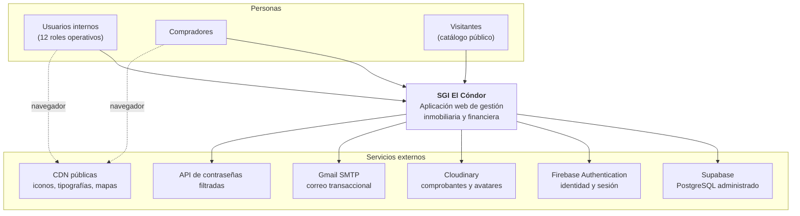
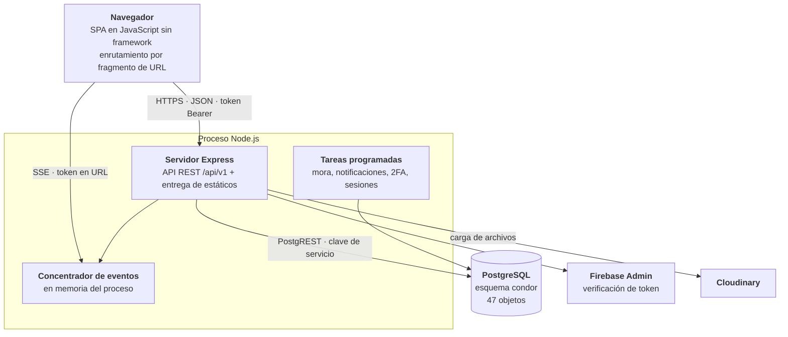
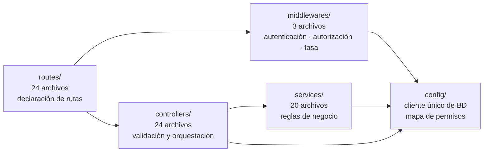
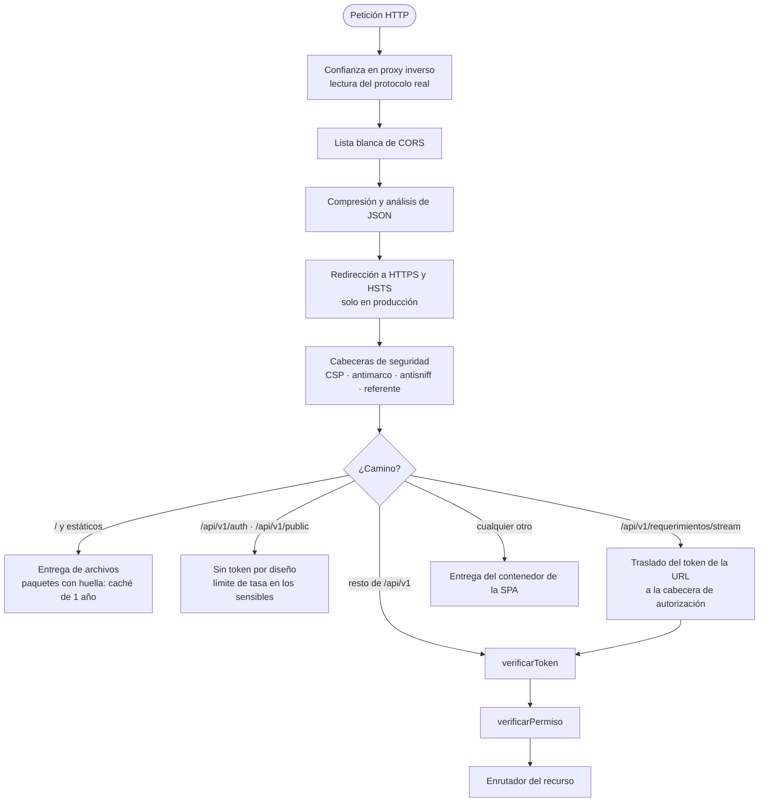

# Documento Técnico y de Arquitectura

## Sistema de Gestión Inmobiliaria SGI El Cóndor

**Versión 1.0 — Entrega final**

Preparado para **El Cóndor S. A. S.**

Elaborado por el equipo de desarrollo del SGI:
Juan Manuel Candela Toro, Jabes Esteban Monroy Becerra,
Juan David Barco Ruiz y Juan Manuel Díaz Gómez

29 de julio de 2026

---

### Control del documento

| Campo | Valor |
|---|---|
| Código | SGI-DOC-ARQ-01 |
| Versión | 1.0 |
| Fecha de emisión | 29 de julio de 2026 |
| Estado | Emitido para entrega |
| Clasificación | Uso interno de El Cóndor S. A. S. |
| Elaborado por | Equipo de desarrollo del SGI |
| Revisado por | Scrum Master (J. M. Candela Toro) |
| Aprobado por | Pendiente de aceptación del área de TI |
| Documentos relacionados | SGI-DOC-FUN-01, SGI-DOC-DAT-01 |

---

> **Nota sobre el formato.** Este documento aplica las convenciones de la séptima
> edición del manual de estilo APA (American Psychological Association, 2020) para
> tablas, figuras, citas y referencias. La descripción arquitectónica se organiza
> en vistas, conforme al enfoque que normaliza la ISO/IEC/IEEE 42010
> (International Organization for Standardization, 2011) y que populariza el
> modelo C4 (Brown, 2018). Los diagramas se expresan en sintaxis Mermaid y van
> acompañados de su interpretación en prosa, de modo que el documento se comprende
> también sin renderizarlos.

---

## Resumen

Este documento describe la arquitectura y la construcción técnica del Sistema de
Gestión Inmobiliaria SGI El Cóndor. El sistema se implementa como una aplicación
web monolítica con separación estricta por capas —controladores, servicios y
acceso a datos—, servida por un proceso Node.js con Express que además entrega el
cliente. La persistencia reside en PostgreSQL administrado por Supabase bajo un
esquema único, la identidad se delega en Firebase Authentication con verificación
en el servidor, y el almacenamiento de documentos se resuelve en Cloudinary.

La decisión arquitectónica que más condiciona el resto es el tratamiento del
estado: los saldos financieros y las existencias de inventario no se almacenan,
se derivan al momento de consultarlos a partir de los hechos que los sustentan.
Esta elección elimina por construcción la clase de defecto más costosa en sistemas
contables —dos módulos que informan cifras distintas sobre el mismo objeto— a
cambio de un costo de cómputo por consulta que el volumen de la operación
absorbe sin dificultad.

El documento presenta las vistas de contexto, contenedores y componentes; el
recorrido completo de una petición a través de la cadena de intermediarios;
diez decisiones de arquitectura documentadas con su alternativa descartada y su
consecuencia; los atributos de calidad con las tácticas que los sostienen; el
proceso de construcción y despliegue; la estrategia de pruebas; y un registro
explícito de deuda técnica con su plan de tratamiento.

**Palabras clave:** arquitectura de software, vistas arquitectónicas, decisiones
de arquitectura, atributos de calidad, estado derivado, deuda técnica

---

## Introducción

### Propósito y audiencia

Una descripción arquitectónica tiene un lector concreto: quien deba modificar el
sistema sin haberlo construido. Bass, Clements y Kazman (2021) sostienen que la
arquitectura es el conjunto de decisiones que resulta costoso revertir; en
consecuencia, el valor de este documento no está en enumerar tecnologías sino en
explicar por qué se eligieron y qué se rompe si se cambian.

El documento se dirige al equipo de desarrollo entrante, al área de TI que operará
el despliegue y a quien deba auditar técnicamente la solución. Presupone
familiaridad con desarrollo web y con bases de datos relacionales, pero no con
este sistema en particular.

### Relación con los otros documentos de la entrega

El Documento Funcional especifica *qué* hace el sistema; este describe *cómo está
construido*; y el Documento de Datos e Integraciones detalla *dónde y cómo se
almacena la información* y *con qué servicios externos conversa*. Cuando una
afirmación de este documento tiene consecuencias sobre el modelo de datos, se
remite al tercero en lugar de duplicarla.

---

## Restricciones y Contexto de la Decisión

Ninguna arquitectura se evalúa en abstracto, sino contra las restricciones bajo
las que se diseñó. Las de este proyecto fueron cuatro y explican buena parte de
las decisiones posteriores.

La primera fue el **equipo**: cuatro desarrolladores a medio tiempo, siete horas
semanales cada uno, durante doce semanas. Con ese presupuesto de esfuerzo, cada
tecnología adicional que exigiera aprendizaje competía directamente con
funcionalidad entregada.

La segunda fue el **perfil de la operación**: una inmobiliaria con un volumen de
decenas de ventas activas y unos pocos usuarios concurrentes internos. El sistema
no necesita escalar a miles de peticiones por segundo, y diseñarlo como si lo
necesitara habría sido un gasto sin retorno.

La tercera fue la **naturaleza contable del dominio**. El sistema administra
dinero de terceros: un saldo incorrecto no es un defecto de interfaz, es un
problema con consecuencias legales. La corrección y la trazabilidad pesaron más
que el rendimiento o la elegancia.

La cuarta fue el **presupuesto de infraestructura**. La solución debía operar
sobre servicios administrados de nivel gratuito o económico, sin equipo dedicado
de operaciones.

---

## Vista de Contexto

**Figura 1**

*Contexto del sistema: usuarios y servicios externos*

*Nota.* Elaboración propia. Las líneas discontinuas indican dependencias que
resuelve el navegador del usuario y no el servidor, distinción relevante para la
política de seguridad de contenido: el servidor debe autorizar explícitamente
esos orígenes para que el cliente pueda cargarlos.

El sistema atiende tres audiencias con superficies distintas. Los usuarios
internos acceden a la aplicación completa según su rol. Los compradores operan un
portal restringido a su propia información. Los visitantes consultan un catálogo
público que no exige autenticación y que constituye, en la práctica, la única
superficie del sistema expuesta sin credenciales junto con los puntos de acceso de
autenticación.

---

## Vista de Contenedores

**Figura 2**

*Contenedores de ejecución y protocolos de comunicación*

*Nota.* Elaboración propia. El concentrador de eventos vive en la memoria del
mismo proceso que atiende la API; esa decisión, discutida en la sección de
decisiones de arquitectura, es la que limita el sistema a una sola instancia de
ejecución.

Conviene destacar que la aplicación cliente y la interfaz de programación se
sirven desde el mismo proceso y el mismo origen. Esto simplifica el modelo de
seguridad —no hay peticiones entre orígenes en la operación normal, y la lista
blanca de CORS existe solo para el desarrollo local y para el dominio público— y
elimina la necesidad de un servidor web adicional.

---

## Vista de Componentes

El código del servidor se organiza en cuatro capas con una regla de dependencia
unidireccional: las rutas conocen a los controladores, los controladores conocen a
los servicios, y solo los servicios y la configuración alcanzan la base de datos.
Ningún componente salta capas hacia arriba.

**Figura 3**

*Componentes del servidor y sentido de las dependencias*

*Nota.* Elaboración propia. La existencia de un único punto de acceso a la base de
datos (`config/supabase.js`) es deliberada: garantiza que la clave de servicio
exista una sola vez en el proceso y que ninguna consulta escape a la convención
del esquema.

### Responsabilidad de cada capa

Las **rutas** solo declaran qué método y camino corresponden a qué manejador, y
qué intermediarios se aplican. No contienen lógica. Una convención sostiene esta
capa: las rutas específicas se declaran antes que las paramétricas, porque Express
resuelve por orden de declaración y `/mis-ventas` sería capturada por `/:id` si se
declarara después.

Los **controladores** validan la entrada, orquestan la operación y traducen el
resultado a una respuesta HTTP con su código de estado. Aquí vive el manejo de
errores y, cuando una operación toca varias tablas, la reversión manual: sin
transacciones distribuidas disponibles a través de la interfaz de datos, el
controlador que crea una venta y falla a mitad de camino deshace explícitamente lo
que ya insertó.

Los **servicios** concentran las reglas de negocio y son la única capa que puede
reutilizarse entre controladores. La regla del proyecto es explícita: cuando una
lógica aparece en dos controladores, se extrae a un servicio. De ahí provienen los
veinte servicios actuales, entre los que destacan tres por su carácter
irreemplazable: el de saldos, única fuente de las cifras financieras; el de
consecutivos, que centraliza todas las numeraciones; y el de recibos, que garantiza
que la emisión sea idempotente.

La **configuración** provee el cliente de base de datos, las credenciales de los
servicios externos y el mapa de autorización.

### Servicios del dominio

**Tabla 1**

*Servicios y responsabilidad de cada uno*

| Servicio | Responsabilidad | Criticidad |
|---|---|---|
| `saldos` | Única fuente de saldos y estados derivados | Máxima |
| `consecutivos` | Numeraciones consecutivas vía función de base de datos | Máxima |
| `recibos` | Emisión idempotente de recibos y reutilización de huérfanos | Máxima |
| `cuotas` | Generación del plan de pago y reversión de venta fallida | Alta |
| `comisiones` | Verificación del umbral de causación | Alta |
| `auth-cache` | Caché de identidad con vencimiento de 60 segundos | Alta |
| `inventario` | Existencias derivadas por normalización del material | Alta |
| `config` | Políticas configurables con caché e implementación por defecto | Alta |
| `auditoria` | Registro de cambios sensibles | Alta |
| `usuarios` | Verificación de compradores inactivos | Media |
| `role-promotion` | Promoción automática a comprador | Media |
| `notificaciones` | Avisos internos con difusión por rol | Media |
| `events` | Concentrador de eventos en tiempo real | Media |
| `empresas` | Validación tributaria de proveedores | Media |
| `two-factor` | Segundo factor de autenticación | Media |
| `session-revocation` | Caducidad periódica de sesiones | Media |
| `login-alert` | Aviso de acceso desde origen nuevo | Baja |
| `respaldos` | Catálogo de respaldos y restauraciones | Baja |
| `email` | Composición y envío de correo transaccional | Baja |
| `mora` | Invocación del recálculo de mora | Baja |

*Nota.* La criticidad expresa el efecto de una modificación incorrecta, no la
complejidad del componente. Los servicios de criticidad máxima afectan
simultáneamente a varios módulos y a la información que ve el comprador.

---

## Recorrido de una Petición

La cadena de intermediarios es el punto donde se concentran las decisiones de
seguridad, y su orden importa: invertir dos pasos puede abrir un acceso o
inutilizar una protección. Se documenta en detalle por esa razón.

**Figura 4**

*Cadena de procesamiento de una petición*

*Nota.* Elaboración propia a partir de `src/index.js`. El traslado del token para
el canal de eventos existe porque la interfaz de navegador para eventos servidos
no permite enviar cabeceras personalizadas; se resuelve en un intermediario previo
para que el resto de la cadena no necesite conocer la excepción.

### Autenticación

El intermediario de autenticación verifica el token de identidad emitido por
Firebase y resuelve a qué usuario del sistema corresponde. La resolución es
híbrida por una razón práctica: los usuarios pueden existir en la base de datos
antes de tener cuenta de acceso, porque el área contable los registra como
compradores. Por eso se busca primero por el identificador de Firebase y, si no
hay coincidencia, por correo electrónico, vinculando en ese momento ambos
registros. Cuando no existe coincidencia por ninguna vía, se aprovisiona una
cuenta nueva con el rol por defecto.

Sobre esa resolución operan dos controles adicionales. El primero es una **caché
de identidad con vencimiento de sesenta segundos**, que evita consultar la base de
datos en cada petición; su corolario indispensable es que toda operación que cambie
el rol, los permisos o el estado activo de un usuario debe invalidarla
explícitamente, o el cambio tardaría hasta un minuto en surtir efecto. El segundo
es la **exigencia de correo verificado** para las cuentas de autorregistro,
aplicada también en el camino con caché: una comprobación que solo actuara en el
camino sin caché sería evitable esperando un segundo intento.

### Autorización

La autorización se resuelve consultando un mapa central que asocia cada
combinación de método y camino con el permiso requerido. El mapa contiene 119
entradas para 151 rutas montadas; la diferencia corresponde a rutas de
autoservicio, cuyos datos se filtran por el usuario autenticado, y a rutas que
autorizan dentro de su controlador.

Hay una particularidad que debe conocerse porque ya causó un incidente y motivó
una historia de usuario propia. La clave del mapa se construye eliminando del
camino los segmentos **numéricos**, con el fin de que `/ventas/42/cancelar`
coincida con la entrada `/ventas/cancelar`. En consecuencia, una ruta cuyo
parámetro no sea numérico —como la clave de una política de configuración— produce
una clave que nunca coincidirá con el mapa, y quedaría accesible a cualquier
usuario autenticado. La solución adoptada fue autorizar dentro del controlador en
esos casos, con la constancia explícita en el archivo de configuración y una
verificación automatizada que detecta cualquier ruta nueva en esa condición.

**Tabla 2**

*Mecanismos de autorización y su ámbito de aplicación*

| Mecanismo | Cuándo se aplica | Verificación automatizada |
|---|---|---|
| Mapa central de permisos | Toda ruta con parámetros numéricos o sin parámetros | Cruce de rutas montadas contra el mapa |
| Excepción de acceso total | Rol administrador | Constancia en el intermediario |
| Autorización en el controlador | Rutas con parámetro no numérico y reglas por rol | Resolución del manejador y lectura de su cuerpo |
| Filtro por usuario autenticado | Puntos de autoservicio | Revisión manual documentada |
| Restricción por estado del dato | Rol jurídico, limitado a cartera en mora | Revisión manual documentada |

*Nota.* Elaboración propia. La tercera fila representa una concesión consciente:
la autorización en el controlador funciona, pero no es visible en el mapa central
ni configurable desde la pantalla de administración de permisos. Se documenta como
deuda arquitectónica en la sección correspondiente.

---

## Decisiones de Arquitectura

Se documentan aquí las decisiones cuya reversión resultaría costosa, con el
formato que propone Nygard (2011): contexto, decisión, alternativa descartada y
consecuencia. La consecuencia es la parte que suele omitirse y la más útil para
quien hereda el sistema.

### AD-01. Estado derivado en lugar de almacenado

**Contexto.** El saldo de una cuota y las existencias de un material pueden
almacenarse como columna y actualizarse con cada movimiento, o calcularse al
consultarlos.

**Decisión.** No se almacenan. El saldo se calcula como el valor de la obligación
menos la suma de los recibos que la respaldan; las existencias, como la suma de
entradas menos salidas.

**Alternativa descartada.** Mantener columnas de saldo y existencias actualizadas
por disparadores de base de datos.

**Consecuencia.** Desaparece por construcción la posibilidad de que dos módulos
informen cifras distintas, que es el defecto más costoso de este dominio. El costo
es de cómputo por consulta, absorbible en el volumen de esta operación. La
contrapartida real es de disciplina: cualquier optimización futura que introduzca
una columna calculada reintroduce el riesgo, por lo que debería implementarse como
caché invalidable y nunca como fuente de verdad.

### AD-02. Cliente web sin marco de trabajo

**Contexto.** El cliente podía construirse con React, Vue o similar, o con
JavaScript estándar.

**Decisión.** JavaScript estándar, con enrutamiento por fragmento de URL, un
registro de vistas y un estado global mínimo para los permisos.

**Alternativa descartada.** React con su cadena de herramientas.

**Consecuencia.** El equipo, con siete horas semanales por persona, invirtió su
tiempo en dominio y no en configuración; no hay dependencias de ejecución en el
cliente que puedan quedar obsoletas. En contrapartida, el crecimiento del sistema
produjo archivos de vista extensos —el mayor supera las dos mil líneas— y la
ausencia de un sistema de componentes favoreció la duplicación de utilidades de
presentación, como se constató en la auditoría al encontrar quince formateadores
monetarios equivalentes. La decisión sigue siendo apropiada para el tamaño actual;
un crecimiento sustancial justificaría reconsiderarla.

### AD-03. Acceso a datos exclusivamente desde el servidor

**Contexto.** Supabase permite que el navegador consulte la base de datos
directamente, delegando la autorización en políticas de seguridad por fila.

**Decisión.** El navegador nunca alcanza la base de datos. Todo pasa por la
interfaz de programación del servidor, que usa una clave de servicio con
privilegios plenos, y las políticas de seguridad por fila se configuran en
denegación por defecto como red de contención.

**Alternativa descartada.** Acceso directo desde el cliente con políticas por
fila como única autorización.

**Consecuencia.** Las reglas de negocio se aplican en un solo lugar y no pueden
evadirse consultando la base de datos por otro camino; a cambio, el servidor es un
paso obligado y la seguridad depende de que la clave de servicio nunca se filtre
al cliente. Por eso el cliente de base de datos se instancia una sola vez en un
módulo del servidor, y por eso la verificación automatizada comprueba que ninguna
consulta ocurra fuera de esa ruta.

### AD-04. Verificación de contraseña en el servidor

**Contexto.** Inicialmente el acceso con contraseña se resolvía enteramente en el
cliente contra Firebase, de modo que el servidor no participaba en el intento
fallido y no podía contarlo.

**Decisión.** El acceso con contraseña se verifica desde el servidor contra el
servicio de identidad, y el servidor devuelve un token personalizado con el que el
cliente abre su sesión. El contador de intentos y el bloqueo residen en la base de
datos del sistema.

**Alternativa descartada.** Mantener la verificación en el cliente y llevar el
conteo también allí.

**Consecuencia.** El bloqueo por intentos fallidos pasa a ser autoritativo, algo
imposible con un contador en el cliente. El orden de las validaciones se vuelve
crítico: se comprueba el bloqueo antes de consultar al servicio de identidad, y el
contador solo se incrementa cuando las credenciales son inválidas contra una
cuenta existente. Invertir estos pasos reintroduciría dos vulnerabilidades
conocidas —la enumeración de correos registrados y el bloqueo malicioso de cuentas
ajenas—, razón por la cual el archivo lo advierte de forma explícita.

### AD-05. Numeración consecutiva delegada a la base de datos

**Contexto.** Los recibos, pagos, facturas y ventas exigen numeración consecutiva
sin huecos ni repeticiones, incluso con operaciones concurrentes.

**Decisión.** La numeración se obtiene invocando una función almacenada en la base
de datos, nunca calculando el siguiente número en la aplicación.

**Alternativa descartada.** Consultar el máximo actual y sumar uno.

**Consecuencia.** La atomicidad la garantiza el motor de base de datos, que es el
único punto capaz de serializar la operación. El efecto secundario es que el
formato de los consecutivos queda acoplado a una función externa al repositorio:
modificarlo exige coordinar código y base de datos, y hacerlo rompería la
trazabilidad histórica de los documentos ya emitidos.

### AD-06. Políticas de negocio en la base de datos

**Contexto.** Los umbrales que clasifican una compra como de caja menor o de alto
monto pierden vigencia con la inflación.

**Decisión.** Se almacenan como configuración en una tabla, con caché de sesenta
segundos y valores por defecto en el código para que el sistema funcione antes de
aplicar la migración correspondiente.

**Alternativa descartada.** Variables de entorno.

**Consecuencia.** El administrador ajusta las políticas desde la interfaz sin
redespliegue. La clasificación de una compra es derivada y se evalúa al leer, de
modo que un cambio de umbral no reescribe el historial: los requerimientos ya
aprobados conservan el recorrido que efectivamente siguieron, y la trazabilidad
muestra cada paso como cumplido u omitido según los datos reales.

### AD-07. Eventos en tiempo real mediante canal servido y concentrador en memoria

**Contexto.** El flujo de requerimientos involucra a varios roles en secuencia y
requiere que las vistas reflejen los cambios sin recargar.

**Decisión.** Se usa un canal de eventos servidos por HTTP, con un concentrador de
suscriptores en la memoria del proceso y latido cada treinta segundos.

**Alternativa descartada.** WebSockets con un intermediario de mensajes, o
consulta periódica desde el cliente.

**Consecuencia.** La solución es simple, no añade infraestructura y degrada con
elegancia: si el canal falla repetidamente, el cliente pasa a consultar
periódicamente. Su límite es estructural y debe conocerse antes de escalar: los
suscriptores viven en la memoria de una instancia, de modo que con dos instancias
los usuarios conectados a una no recibirían los eventos originados en la otra.
Habilitar escalado horizontal exige sustituir el concentrador por un canal
compartido; el archivo del servicio lo advierte en su encabezado.

### AD-08. Avisos internos de mejor esfuerzo

**Contexto.** Las transiciones de negocio generan notificaciones y correos.

**Decisión.** El envío de avisos nunca interrumpe la operación de negocio: si
falla, se registra y se continúa. El servicio de notificaciones no propaga
excepciones y los correos se despachan sin encadenar fallos.

**Alternativa descartada.** Tratar el envío como parte de la transacción.

**Consecuencia.** Una caída del proveedor de correo no impide aprobar un
requerimiento ni aceptar un pago, lo cual es el comportamiento correcto para este
dominio: el hecho de negocio es más importante que su notificación. El costo es
que un fallo de notificación es silencioso, y por eso la observabilidad de esos
avisos depende de los registros del proceso.

### AD-09. Empaquetado por concatenación con huella de contenido

**Contexto.** El cliente se compone de decenas de archivos que en desarrollo se
cargan individualmente.

**Decisión.** Para producción se generan tres artefactos —los guiones clásicos
concatenados y minificados, los módulos empaquetados y los estilos— cada uno con
una huella derivada de su contenido, referenciados desde un contenedor generado.

**Alternativa descartada.** Servir los archivos sueltos también en producción.

**Consecuencia.** Los artefactos pueden almacenarse en caché durante un año con
seguridad, porque cualquier cambio produce una huella distinta. La contrapartida
es que el orden de concatenación es significativo, ya que los guiones clásicos
comparten ámbito global: un archivo nuevo que no se agregue a la lista funciona en
desarrollo y falla en producción. Ese riesgo es tan concreto que se cubrió con dos
mecanismos —una verificación automatizada que compara la lista con los archivos
reales, y un paso de compilación en la integración continua—.

### AD-10. Un solo esquema de base de datos

**Contexto.** La base de datos podía organizarse en varios esquemas por dominio.

**Decisión.** Un esquema único para toda la aplicación, referenciado
explícitamente en cada consulta.

**Alternativa descartada.** Separación por esquemas o por bases de datos.

**Consecuencia.** Las consultas con relaciones incorporadas resultan directas y no
hay ambigüedad de resolución. La regla exige disciplina —toda consulta debe
declarar el esquema— y tiene una excepción heredada: la función de consecutivos
reside en el esquema público y se invoca sin declararlo. Es la única excepción,
está documentada, y modificarla rompería todas las numeraciones.

---

## Atributos de Calidad y Tácticas

Los atributos de calidad se expresan mejor como escenarios que como adjetivos: no
basta afirmar que un sistema es seguro, hay que decir ante qué estímulo y con qué
respuesta medible (Bass et al., 2021). La tabla siguiente recoge los escenarios
que efectivamente guiaron decisiones.

**Tabla 3**

*Escenarios de calidad y tácticas que los sostienen*

| Atributo | Escenario | Táctica implementada |
|---|---|---|
| Seguridad | Un atacante prueba contraseñas por fuerza bruta contra una cuenta conocida | Bloqueo autoritativo en servidor tras cinco fallos; límite de tasa por origen |
| Seguridad | Un atacante quiere averiguar qué correos están registrados | Respuesta idéntica para cuenta inexistente y contraseña incorrecta |
| Seguridad | Una sesión válida es secuestrada a mitad de uso | Segundo factor para roles sensibles y reautenticación ante acciones críticas |
| Seguridad | Un tercero intenta enmarcar la aplicación o inyectar guiones | Política de seguridad de contenido restrictiva, antimarco y antisniff |
| Seguridad | Se añade una ruta nueva y se olvida su permiso | Verificación automatizada que falla si una ruta queda sin autorización |
| Fiabilidad | El proveedor de correo no responde durante una aprobación | Avisos de mejor esfuerzo que no abortan la operación |
| Fiabilidad | La creación de una venta falla a mitad de camino | Reversión manual explícita del controlador |
| Fiabilidad | Dos aprobadores actúan simultáneamente sobre el mismo requerimiento | Condición sobre el estado en la propia operación de escritura |
| Integridad | Un pago se procesa dos veces | Emisión de recibo idempotente y reutilización de huérfanos |
| Mantenibilidad | Alguien modifica el cálculo del saldo | Fuente única con pruebas; el efecto se propaga a todas las vistas por igual |
| Mantenibilidad | Se agrega un archivo de cliente y se olvida en el empaquetado | Verificación de registro de vistas y compilación en integración continua |
| Observabilidad | Falla el recálculo periódico de mora | Registro del resultado en cada corrida |

*Nota.* Elaboración propia. Los escenarios de seguridad provienen de la revisión
de las categorías de riesgo más frecuentes en aplicaciones web
(Open Worldwide Application Security Project, 2021) contrastadas con la superficie
real del sistema.

### Cabeceras y política de seguridad de contenido

La política de seguridad de contenido se acotó a lo que el cliente carga
realmente, en lugar de adoptar una plantilla genérica. Autoriza tipografías y
hojas de estilo de sus proveedores, los guiones del servicio de identidad y de las
bibliotecas cargadas de forma diferida, las imágenes remotas del gestor de
documentos y los mosaicos del mapa, y la consulta a la interfaz de contraseñas
filtradas. Se permite estilo y guion en línea porque el cliente los genera al
construir la interfaz; es la concesión más relevante de la política y la que
convendría eliminar si en el futuro se refactoriza la generación de marcado.

En producción se fuerza HTTPS y se declara el transporte estricto; en desarrollo
esos controles se omiten para que el entorno local siga funcionando sobre HTTP
sin cifrar.

---

## Construcción y Despliegue

### Vista de despliegue

El sistema se despliega en una plataforma de aplicaciones administrada, con **una
sola instancia de ejecución**. Esta cifra no es un detalle de capacidad: es una
precondición de corrección, por la decisión AD-07.

**Tabla 4**

*Artefactos de construcción y su tratamiento*

| Artefacto | Contenido | Caché |
|---|---|---|
| `dist/sgi.min.js` | Guiones clásicos concatenados (≈875 KB) | Inmutable, un año |
| `dist/app.min.js` | Módulos empaquetados (≈16 KB) | Inmutable, un año |
| `dist/sgi.min.css` | Estilos concatenados (≈157 KB) | Inmutable, un año |
| `index.prod.html` | Contenedor generado con las huellas vigentes | Sin caché |

*Nota.* Tamaños de la construcción del 29 de julio de 2026. La caché de un año es
segura porque la huella del contenido forma parte de la referencia: un cambio
produce una dirección distinta.

### Entornos

El comportamiento del sistema difiere entre entornos en tres aspectos, todos
gobernados por una única variable: en producción se sirve el contenedor generado
con artefactos empaquetados, se fuerza HTTPS con transporte estricto y se desactiva
la recarga automática; en desarrollo se sirven los archivos sueltos con recarga
automática y sin exigencia de cifrado.

### Configuración por entorno

La aplicación exige un conjunto de variables de entorno sin las cuales no
arranca —la dirección y la clave de servicio de la base de datos hacen fallar el
proceso de forma deliberada si faltan, en lugar de permitir un arranque
aparentemente correcto—. El repositorio incluye una plantilla de esas variables
sin valores reales. El detalle de cada variable y del servicio al que corresponde
se encuentra en el Documento de Datos e Integraciones.

### Tareas programadas

Cuatro tareas se ejecutan al arranque o cada veinticuatro horas dentro del mismo
proceso: el recálculo del estado de mora, la purga de notificaciones leídas con más
de sesenta días, la limpieza de desafíos de segundo factor vencidos y la caducidad
periódica de sesiones. Alojarlas en el proceso de la aplicación es coherente con
la restricción de una sola instancia; si se habilitara escalado horizontal,
también estas tareas requerirían coordinación para no ejecutarse por duplicado.
Constituye un punto que la sección de deuda técnica recoge.

### Integración continua

Cada cambio propuesto se verifica automáticamente con cuatro pasos elegidos por lo
que cada uno detecta y no por convención: la instalación estricta desde el archivo
de bloqueo, que revela dependencias usadas pero no declaradas; la ejecución de las
pruebas; la compilación de producción, que revela archivos ausentes de la lista de
empaquetado; y la auditoría estática de coherencia. Un quinto paso vigila que no
aparezcan vulnerabilidades altas o críticas en dependencias de producción,
calibrado para no fallar por la deuda heredada que no está en nuestras manos
resolver.

---

## Estrategia de Pruebas

La estrategia combina tres niveles con propósitos distintos, y declara con
franqueza el que falta.

**Tabla 5**

*Niveles de prueba, cobertura y propósito*

| Nivel | Alcance | Estado |
|---|---|---|
| Unitarias | Servicios del dominio, con la base de datos simulada | 164 pruebas en 18 archivos |
| Auditoría estructural | Coherencia entre rutas, permisos, vistas, esquema y dependencias | 7 verificaciones automatizadas |
| Verificación manual por rol | Comportamiento observable de la interfaz | Lista de verificación en la definición de terminado |
| Extremo a extremo | Flujos completos en navegador | **Ausente**, declarado como deuda |

*Nota.* Elaboración propia. La ausencia de pruebas de extremo a extremo es la
brecha más relevante de la estrategia y se consigna en el registro de deuda
técnica.

Las pruebas unitarias se concentraron donde el error es más caro: las
derivaciones financieras. El servicio de comisiones, por ejemplo, se cubre con
doce casos que verifican el umbral exacto, el cómputo de las permutas como parte
del pago, la exclusión de los pagos sin recibo que los respalde y la ausencia de
rastro de auditoría cuando la operación falla. Este último caso ilustra el
criterio con que se diseñaron: no basta comprobar que el sistema hace lo correcto
cuando todo funciona, hay que comprobar que no deja rastros falsos cuando algo
falla.

La auditoría estructural merece una nota metodológica. Cada verificación
automatizada está construida para no fallar en silencio: lo que no puede
interpretar lo reporta como una limitación de cobertura en lugar de omitirlo. Esta
decisión evita el peor resultado posible de una herramienta de verificación, que
es dar luz verde sobre un área que en realidad no examinó.

---

## Deuda Técnica

El registro siguiente distingue entre lo que conviene resolver y lo que conviene
únicamente conocer. Declararla no es una concesión: una arquitectura sin deuda
declarada suele ser una arquitectura con deuda oculta.

**Tabla 6**

*Registro de deuda técnica*

| Deuda | Origen | Riesgo si no se atiende | Tratamiento recomendado |
|---|---|---|---|
| Concentrador de eventos en memoria | AD-07 | Al escalar a varias instancias, los avisos dejan de alcanzar a todos los usuarios | Sustituir por canal compartido **antes** de habilitar escalado |
| Tareas programadas dentro del proceso | Simplicidad de despliegue | Con varias instancias se ejecutarían por duplicado | Externalizar la programación o coordinar por bloqueo |
| Autorización dentro de controladores | Limitación del mapa central con parámetros no numéricos | Reglas invisibles en la administración de permisos | Normalizar el segmento en el intermediario y unificar en el mapa |
| Nomenclatura mixta español-inglés | Evolución del proyecto | Fricción de lectura para quien llega | Migrar por oportunidad, al tocar cada archivo |
| Utilidades de presentación duplicadas | Ausencia de sistema de componentes (AD-02) | Divergencia futura entre vistas | Unificar en la utilidad compartida existente |
| Archivos de vista extensos | Ausencia de sistema de componentes (AD-02) | Dificultad de mantenimiento y revisión | Descomponer los mayores por secciones |
| Pruebas de extremo a extremo ausentes | Prioridad de alcance funcional | Regresiones de interfaz solo detectables a mano | Cubrir primero los flujos de dinero |
| Ocho vulnerabilidades moderadas | Transitivas de la biblioteca de identidad | Ninguna acción posible por nuestra parte | Actualizar cuando el proveedor publique |
| Estilo y guion en línea permitidos | Generación de marcado en el cliente | Menor protección frente a inyección de guiones | Eliminar tras refactorizar la generación de marcado |

*Nota.* Elaboración propia a partir de la auditoría de entrega. Las tres primeras
filas comparten una característica: son inocuas en la configuración actual y se
vuelven defectos al cambiar el modo de despliegue. Por eso se enuncian como
precondiciones y no como tareas pendientes.

---

## Evolución Prevista

Si el sistema debe crecer, el orden de las intervenciones importa. La secuencia
recomendada es la siguiente, y su lógica es que cada paso habilita el siguiente sin
introducir riesgo.

Primero, **cubrir con pruebas de extremo a extremo los flujos de dinero**. Sin esa
red, cualquier refactorización posterior se hace a ciegas. Segundo, **sustituir el
concentrador de eventos por un canal compartido y externalizar las tareas
programadas**; hasta que eso ocurra, el escalado horizontal está vedado. Tercero,
**unificar la autorización en el mapa central**, normalizando los segmentos no
numéricos, con lo que la administración de permisos vuelve a reflejar la realidad
completa. Y solo entonces, si el volumen lo justifica, **reconsiderar el cliente
sin marco de trabajo**, cuya sustitución es la intervención más costosa y la que
menos urge.

---

## Referencias

American Psychological Association. (2020). *Publication manual of the American
Psychological Association* (7th ed.). https://doi.org/10.1037/0000165-000

Bass, L., Clements, P., & Kazman, R. (2021). *Software architecture in practice*
(4th ed.). Addison-Wesley.

Brown, S. (2018). *Software architecture for developers: Volume 2 — Visualise,
document and explore your software architecture*. Leanpub.

Fielding, R. T. (2000). *Architectural styles and the design of network-based
software architectures* [Doctoral dissertation, University of California, Irvine].
https://www.ics.uci.edu/~fielding/pubs/dissertation/top.htm

Fowler, M. (2018). *Refactoring: Improving the design of existing code* (2nd ed.).
Addison-Wesley.

Humble, J., & Farley, D. (2010). *Continuous delivery: Reliable software releases
through build, test, and deployment automation*. Addison-Wesley.

International Organization for Standardization. (2011). *Systems and software
engineering — Architecture description* (ISO/IEC/IEEE 42010:2011).
https://www.iso.org/standard/50508.html

Kruchten, P. (1995). The 4+1 view model of architecture. *IEEE Software, 12*(6),
42–50. https://doi.org/10.1109/52.469759

Martin, R. C. (2008). *Clean code: A handbook of agile software craftsmanship*.
Prentice Hall.

Nygard, M. T. (2011). *Documenting architecture decisions*.
https://cognitect.com/blog/2011/11/15/documenting-architecture-decisions

Nygard, M. T. (2018). *Release it! Design and deploy production-ready software*
(2nd ed.). Pragmatic Bookshelf.

Open Worldwide Application Security Project. (2021). *OWASP Top 10: The ten most
critical web application security risks*. https://owasp.org/Top10/

Sommerville, I. (2016). *Software engineering* (10th ed.). Pearson Education.

---

## Apéndices

**Apéndice A. Inventario de rutas y permisos efectivos.** Detalle de las 151 rutas
montadas con su clave de autorización y el permiso exigido. Disponible en
`docs/auditoria/anexos/01-routes-vs-permissions.md`.

**Apéndice B. Informe consolidado de auditoría.** Hallazgos por área con su
ubicación en el código. Disponible en `docs/auditoria/informe-hallazgos.md`.

**Apéndice C. Verificaciones de consistencia entre vistas.** Método y veredicto de
las seis comprobaciones manuales. Disponible en
`docs/auditoria/fase2-verificaciones.md`.
