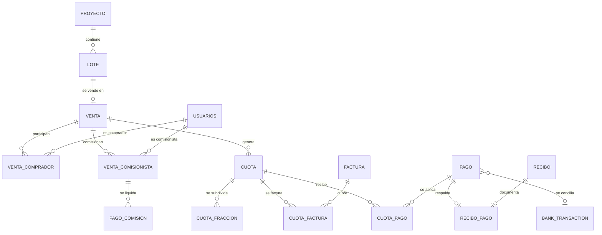
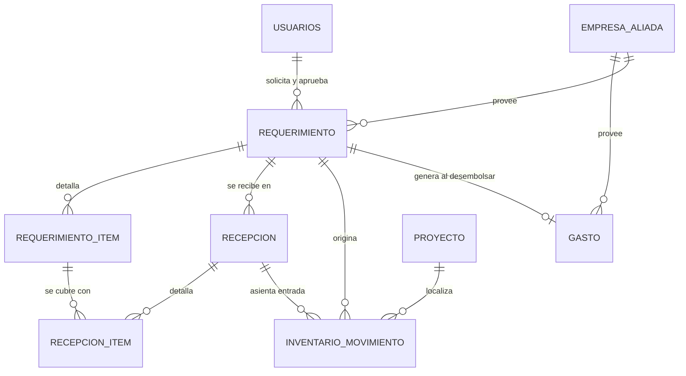

# Documento de Datos e Integraciones

## Sistema de Gestión Inmobiliaria SGI El Cóndor

**Versión 1.0 — Entrega final**

Juan Manuel Candela Toro, Jabes Esteban Monroy Becerra,
Juan David Barco Ruiz y Juan Manuel Díaz Gómez

Universidad Nacional de Colombia

Ingeniería de Software

[Nombre del docente]

29 de julio de 2026

---

> **Nota sobre el formato.** Este documento sigue las normas APA en su séptima
> edición (American Psychological Association, 2020). El diccionario de datos se
> entrega como anexo generado automáticamente desde el esquema vigente, decisión
> metodológica que se justifica en la sección correspondiente.

---

## Resumen

Este documento describe la organización de la información del Sistema de Gestión
Inmobiliaria SGI El Cóndor y los servicios externos con los que el sistema
conversa. La persistencia reside en una base de datos PostgreSQL administrada por
Supabase, bajo un esquema único denominado `condor` que expone 35 tablas, 12 vistas
derivadas, 3 funciones almacenadas y 9 tipos enumerados.

El modelo de datos obedece a cinco principios que conviene enunciar de entrada
porque explican decisiones que de otro modo parecerían omisiones: el estado
financiero y las existencias no se almacenan sino que se derivan; el inventario se
registra como libro de movimientos que solo admite adiciones; los recibos son
inmutables; las numeraciones consecutivas se delegan al motor de base de datos; y
todo cambio sensible deja rastro en una bitácora de auditoría.

El documento incluye además el catálogo completo de integraciones externas con su
modo de fallo y su comportamiento degradado, las políticas de retención de datos,
el esquema de respaldo y recuperación, y un registro de deuda de modelado
detectada durante la auditoría de entrega, entre la que destacan dos tablas de
relación sin clave primaria declarada y una tabla financiera que arrastra dos
modelos de estado en paralelo.

**Palabras clave:** modelo de datos, integridad referencial, estado derivado,
diccionario de datos, integraciones, retención de datos

---

## Introducción

### Propósito

Este documento responde a tres preguntas: dónde vive cada dato, qué garantías
tiene, y de qué servicios externos depende el sistema para funcionar. Su lector
típico es quien deba modificar el esquema, diagnosticar una inconsistencia o
sustituir un proveedor externo.

Se apoya en el principio de que el modelo de datos es la parte más duradera de un
sistema de información: las interfaces se rediseñan y el código se reescribe, pero
los datos suelen sobrevivir a varias generaciones de ambos (Kleppmann, 2017). Por
esa razón se documentan con detalle no solo las estructuras vigentes, sino también
las decisiones de integridad y los residuos históricos que conviene conocer antes
de tocarlas.

### Relación con los otros documentos

El Documento Funcional especifica las reglas de negocio en términos de
comportamiento observable; este documento indica dónde se materializan esas reglas
como restricciones, derivaciones o convenciones de datos. El Documento Técnico y de
Arquitectura describe las decisiones de construcción; aquí se detallan sus
consecuencias sobre el almacenamiento.

---

## Principios de Diseño de Datos

### Esquema único con referencia explícita

Toda la aplicación reside en el esquema `condor`, y cada consulta lo declara
explícitamente. La alternativa —separar por dominios— habría complicado las
consultas con relaciones incorporadas sin beneficio proporcional en un sistema de
este tamaño. La regla tiene una única excepción heredada, documentada más adelante:
la función de numeración consecutiva reside en el esquema público.

### El estado se deriva, no se almacena

Es el principio con más consecuencias visibles. El saldo de una obligación y las
existencias de un material no ocupan ninguna columna: se calculan al consultarlos.
La motivación es directa. Una columna de saldo puede quedar desincronizada respecto
de los pagos que la sustentan, y cuando eso ocurre en un sistema contable el
problema no es técnico sino legal, porque dos módulos informan cifras distintas
sobre el dinero de un tercero. Derivar el valor hace que esa divergencia sea
imposible por construcción.

**Tabla 1**

*Valores derivados y su fórmula canónica*

| Valor derivado | Fórmula | Implementación |
|---|---|---|
| Saldo de una cuota o fracción | Valor − Σ recibos que la respaldan | `saldos.service` |
| Estado contable de una cuota | Función del saldo y de los días de vencimiento | `saldos.service` |
| Estado de una factura | Función de la porción de saldo cubierta | `saldos.service` |
| Existencias de un material | Σ entradas − Σ salidas, agrupadas por material, unidad y proyecto | `inventario.service` |
| Disponibilidad de un lote | Existencia de una venta activa sobre él | `lotes.controller` |
| Categoría de una compra | Comparación del monto con los umbrales vigentes | `config.service` |
| Historial comercial de una empresa | Gastos y desembolsos vinculados | `empresas_aliadas.controller` |

*Nota.* Elaboración propia. La última columna importa tanto como la fórmula: cada
derivación tiene un único punto de implementación, y duplicarla en otro módulo
reintroduciría exactamente el problema que este principio evita.

### El inventario es un libro que solo admite adiciones

Los movimientos de inventario se registran como asientos de entrada o salida que
nunca se modifican ni se borran. Las existencias son su suma. Este patrón —conocido
como registro de solo adición— permite reconstruir el estado en cualquier momento
del pasado y auditar cada movimiento con su documento de origen, a costa de que la
consulta de existencias implique una agregación.

Una consecuencia práctica merece atención: el agrupamiento depende de que el nombre
del material se normalice de forma consistente antes de compararlo. Modificar esa
normalización descuadraría los grupos históricos, por lo que constituye un punto
sensible del esquema.

### Los recibos son inmutables

Un recibo, una vez emitido, no se modifica ni se elimina. Su numeración es
consecutiva y sin huecos. De aquí se deriva una regla operativa con efecto directo
sobre el modelo: una venta con recibos asociados no puede borrarse, solo cancelarse,
porque eliminarla dejaría un recibo huérfano y rompería la secuencia. La emisión es
además idempotente: reprocesar un pago ya aceptado no genera un segundo recibo.

### Toda operación crítica deja rastro

Los cambios de estado, de valor, de vínculo o de pertenencia sobre objetos críticos
se registran en la tabla de auditoría con el valor anterior, el nuevo, el usuario y
el motivo. La bitácora es de solo adición y constituye la evidencia sobre la que
opera el control interno.

---

## Modelo Conceptual

El esquema se organiza en cinco dominios. La separación es conceptual —el esquema
físico es plano— pero corresponde a límites reales de responsabilidad.

**Tabla 2**

*Dominios del modelo de datos*

| Dominio | Tablas | Propósito |
|---|---|---|
| Operación comercial | 6 | Inventario de proyectos y lotes, ventas y sus partícipes, proveedores |
| Ciclo financiero | 12 | Cuotas, facturas, pagos, recibos, conciliación bancaria, comisiones y gastos |
| Requerimientos e inventario | 5 | Solicitudes internas, recepciones y libro de movimientos |
| Identidad y autorización | 5 | Usuarios, roles, permisos y desafíos de segundo factor |
| Gobierno del sistema | 7 | Auditoría, notificaciones, configuración, consecutivos, jurídico y respaldos |

*Nota.* Suma 35 tablas. El detalle columna por columna se encuentra en el anexo del
diccionario de datos.

**Figura 1**

*Modelo entidad-relación del ciclo financiero*



*Nota.* Elaboración propia a partir del esquema vigente. Las tablas
`CUOTA_FACTURA`, `CUOTA_PAGO` y `RECIBO_PAGO` son tablas de relación con clave
primaria compuesta, lo que impide por construcción que un mismo pago se aplique dos
veces a la misma cuota o que un recibo documente dos veces el mismo pago.

**Figura 2**

*Modelo entidad-relación del flujo de requerimientos e inventario*



*Nota.* Elaboración propia. La tabla `REQUERIMIENTO` concentra diez claves
foráneas, todas hacia `usuarios` o `proyecto`, porque registra en columnas
separadas al solicitante y a cada firmante del recorrido de aprobación. Ese diseño
—una columna de responsable y otra de fecha por cada paso— es el que permite
reconstruir la trazabilidad sin consultar la bitácora.

---

## Diccionario de Datos

El diccionario se entrega como **anexo generado automáticamente** desde el esquema
vigente, no transcrito a mano. La decisión es metodológica y merece justificarse:
un diccionario transcrito comienza a divergir de la base de datos el día siguiente
de escribirse, y esa divergencia es invisible hasta que alguien confía en él y se
equivoca. Generarlo convierte la actualización en un comando y elimina la
posibilidad de error de transcripción.

El anexo documenta, para cada una de las 35 tablas y 12 vistas: el nombre y tipo de
cada columna, si admite valor nulo, su condición de clave primaria o foránea con el
destino de la referencia, y las notas del esquema. Se encuentra en
`docs/entrega/anexos/diccionario-datos.md` y se regenera con
`node tools/audit/gen-data-dictionary.js`.

**Tabla 3**

*Tablas de mayor complejidad estructural*

| Tabla | Columnas | Claves foráneas | Razón de su tamaño |
|---|---|---|---|
| `requerimiento` | 34 | 10 | Registra responsable y fecha de cada paso del recorrido de aprobación |
| `usuarios` | 21 | 1 | Identidad, datos personales, control de acceso y estado de bloqueo |
| `empresa_aliada` | 15 | 1 | Identificación tributaria, actividades económicas y datos de contacto |
| `gasto` | 14 | 2 | Clasificación por proyecto, categoría y vínculo opcional a proveedor |
| `pago` | 14 | 3 | Método, comprobante, conciliación y tratamiento de excedentes |
| `lote` | 13 | 1 | Identificación, precio, estado y geometría cartográfica |

*Nota.* Datos extraídos del catálogo del esquema. La concentración de columnas en
`requerimiento` es una decisión consciente: la alternativa —una tabla de eventos de
aprobación— habría normalizado mejor, pero complicaba la consulta del estado
actual, que es la operación más frecuente.

### Tipos enumerados

El esquema define nueve tipos enumerados propios, empleados para los estados de las
entidades principales y para el método de pago. Usar tipos enumerados en lugar de
texto libre traslada la validación del valor al motor de base de datos, de modo que
un estado inválido es imposible de insertar incluso desde una consulta manual.

**Tabla 4**

*Tipos enumerados del esquema*

| Tipo | Columna que lo emplea |
|---|---|
| `estado_proyecto` | `proyecto.estado` |
| `estado_lote` | `lote.estado` |
| `estado_venta` | `venta.estado` |
| `estado_cuota` | `cuota.estado` |
| `estado_factura` | `factura.estado` |
| `metodo_pago` | `pago.metodo_pago` |
| `tipo_excedente_enum` | `pago.tipo_excedente` |
| `estado_requerimiento` | `requerimiento.estado` |
| `estado_comision` | `venta_comisionista.estado` |

*Nota.* El último tipo corresponde a una columna heredada cuyo estado real reside
hoy en otras columnas de la misma tabla; el asunto se detalla en la sección de deuda
de modelado.

---

## Integridad Referencial y Restricciones

### Garantías vigentes

El esquema declara clave primaria en 33 de las 35 tablas y emplea claves primarias
compuestas en las tres tablas de relación del ciclo financiero —`cuota_factura`,
`cuota_pago` y `recibo_pago`— y en la de autorización `rol_permiso`, lo que impide
duplicar la asociación entre dos entidades. Las claves foráneas conectan cada
entidad con su contexto, y los tipos enumerados restringen los estados posibles.

Además de las restricciones declarativas, tres invariantes se validan en la capa de
aplicación porque expresan reglas de negocio que el motor de base de datos no puede
formular por sí solo: que los porcentajes de participación de los compradores de
una venta sumen exactamente cien, que la suma de las cuotas iguale el valor
financiado, y que las permutas no alcancen el valor total de la venta.

### Hallazgo: dos tablas de relación sin clave primaria

La auditoría de entrega detectó que `venta_comprador` y `venta_comisionista` no
declaran clave primaria. Ambas son tablas de relación entre una venta y un usuario,
y su ausencia de clave permite insertar la misma pareja dos veces.

El efecto potencial no es cosmético. En `venta_comprador`, una fila duplicada
alteraría la suma de porcentajes de participación —invariante que la aplicación
valida al crear la venta, pero que un duplicado posterior podría romper sin que
nada lo advierta—. En `venta_comisionista`, un duplicado produciría una comisión
contabilizada dos veces.

No se encontró evidencia de que el caso haya ocurrido, y la aplicación no ofrece
ninguna ruta que inserte duplicados. Se trata, por tanto, de una garantía ausente y
no de un defecto activo. La corrección recomendada consiste en declarar clave
primaria compuesta sobre el par de identificadores, verificando previamente que no
existan duplicados:

```sql
-- Verificación previa: debe devolver cero filas.
SELECT id_venta, id_usuario, COUNT(*)
  FROM condor.venta_comprador
 GROUP BY id_venta, id_usuario HAVING COUNT(*) > 1;

ALTER TABLE condor.venta_comprador
  ADD CONSTRAINT pk_venta_comprador PRIMARY KEY (id_venta, id_usuario);

ALTER TABLE condor.venta_comisionista
  ADD CONSTRAINT pk_venta_comisionista PRIMARY KEY (id_venta, id_usuario);
```

Esta intervención se documenta como recomendación posterior a la entrega y no se
aplicó durante la auditoría, por criterio de prudencia: añadir una restricción a
una tabla en producción exige verificar antes la ausencia de duplicados y coordinar
la ventana de aplicación.

### Hallazgo: modelos de estado en paralelo en la tabla de comisiones

La tabla `venta_comisionista` conserva dos representaciones simultáneas del mismo
concepto. Por un lado, las columnas `causada` y `fecha_causada`, que son las que la
aplicación escribe y lee hoy para determinar si una comisión se ha causado. Por
otro, las columnas `estado` y `fecha_ganada`, procedentes de un diseño anterior. A
ello se añade una redundancia en el registro del pago: coexisten `pagada`,
`fecha_pagada` y `fecha_pagado`.

La verdad operativa reside en `causada` y `fecha_causada`. Las columnas heredadas
no se actualizan, de modo que cualquier consulta directa sobre `estado` obtendría
información obsoleta. Es un riesgo real para quien consulte la base de datos sin
conocer esta historia: la columna existe, es obligatoria y parece autoritativa.

La recomendación es depurar el esquema en una ventana posterior a la entrega,
verificando primero que ningún informe externo consuma las columnas heredadas. La
depuración no debería hacerse antes de la entrega: eliminar columnas de una tabla
financiera es una operación irreversible cuyo beneficio es de claridad, no de
corrección.

---

## Vistas Derivadas

El esquema expone doce vistas que precalculan agregaciones para los tableros y los
informes. Como toda vista, no almacenan datos: los derivan en cada consulta, de
modo que no pueden desincronizarse de las tablas subyacentes.

**Tabla 5**

*Vistas del esquema y su consumo desde la aplicación*

| Vista | Consumida por el backend |
|---|---|
| `v_aux_panel_operaciones_diarias` | Sí |
| `vw_cartera_consolidada` | Sí |
| `vw_alertas_juridicas` | Sí |
| `vw_cartera_juridica` | Sí |
| `vw_auditoria_basica_operaciones` | Sí |
| `vw_dir_cartera_resumen_hoy` | Sí |
| `vw_dir_recaudo_facturacion_historico` | Sí |
| `vw_dir_comisiones_resumen` | Sí |
| `vw_auditoria_juridica` | No |
| `vw_dir_auditoria` | No |
| `vw_dir_recaudo_facturacion_hoy` | No |
| `vw_disponibilidad_comercial` | No |

*Nota.* Verificado mediante el cruce automatizado de todas las consultas del
backend contra el esquema real. Las cuatro vistas no consumidas se conservan
deliberadamente: una vista no ocupa almacenamiento ni puede quedar inconsistente,
de modo que su costo de mantenimiento es nulo y pueden resultar útiles para
consultas analíticas directas.

---

## Funciones Almacenadas

El sistema delega tres operaciones al motor de base de datos, en todos los casos
porque requieren garantías que la aplicación no puede ofrecer.

**Tabla 6**

*Funciones almacenadas y motivo de la delegación*

| Función | Esquema | Motivo |
|---|---|---|
| `next_consecutivo_condor` | `public` | Atomicidad de la numeración consecutiva bajo concurrencia |
| `actualizar_mora` | `condor` | Recálculo masivo del estado de mora en una sola operación |
| `fn_excedente_pago` | `condor` | Cálculo del excedente de un pago |

*Nota.* La primera función constituye la única excepción a la regla de esquema
único del proyecto: reside en `public` y se invoca sin declarar esquema. Está
documentada como excepción conocida; modificarla o moverla rompería todas las
numeraciones vigentes y, con ellas, la trazabilidad histórica de los documentos ya
emitidos.

### Numeración consecutiva

La numeración se apoya en la tabla `consecutivos`, con clave primaria compuesta por
prefijo y periodo, sobre la que opera la función. La aplicación nunca calcula el
siguiente número.

**Tabla 7**

*Formatos de numeración del sistema*

| Documento | Formato | Periodicidad |
|---|---|---|
| Pago | `PAG-YYYYMM-NNNNN` | Mensual |
| Recibo | `RC-YYYYMM-NNNNN` | Mensual, correlativo con el pago |
| Micropago de comisión | `MCOM-YYYYMM-NNNNN` | Mensual |
| Factura | `FV-YYYYMM-SIGLA-NNNNN` | Mensual, por proyecto |
| Venta | `#NNN-SIGLA-LOTE` | Secuencia global continua |
| Requerimiento | `REQ-N` | Secuencia global continua |

*Nota.* La numeración de ventas usa un periodo centinela para mantener una única
secuencia continua en lugar de reiniciarse por mes. El código de venta es inmutable
una vez almacenado.

---

## Seguridad de los Datos

### Modelo de acceso

El navegador nunca alcanza la base de datos. Todas las consultas provienen del
servidor, que emplea una credencial de servicio con privilegios plenos, y la
autorización se resuelve en la capa de aplicación antes de consultar. Como red de
contención, las políticas de seguridad por fila se configuran en denegación por
defecto, de modo que una credencial anónima filtrada no obtendría acceso a los
datos.

Esta arquitectura implica que **la protección de la credencial de servicio es la
protección de todos los datos**. De ahí la regla de instanciar el cliente de base
de datos en un único módulo del servidor y la verificación automatizada que
comprueba que ninguna consulta ocurra fuera de esa ruta.

### Datos personales tratados

El sistema almacena datos personales de compradores, comisionistas y personal
interno, cuya identificación es necesaria para la trazabilidad contable pero cuyo
tratamiento conviene declarar.

**Tabla 8**

*Categorías de datos personales y su finalidad*

| Categoría | Finalidad | Ubicación |
|---|---|---|
| Nombre, documento de identidad | Identificación del titular en documentos contables | `usuarios` |
| Correo electrónico y teléfono | Notificación y contacto comercial | `usuarios` |
| Identificador de autenticación externa | Vínculo con el proveedor de identidad | `usuarios` |
| Fotografía de perfil | Identificación en la interfaz | Gestor de documentos externo |
| Comprobantes de pago | Respaldo documental de la transacción | Gestor de documentos externo |
| Registro de intentos de acceso y bloqueo | Protección de la cuenta | `usuarios` |
| Bitácora de acciones por usuario | Auditoría y control interno | `auditoria` |

*Nota.* Elaboración propia. Los comprobantes y las fotografías residen en el gestor
de documentos externo y la base de datos conserva únicamente su dirección. Esa
separación implica que la eliminación de un titular exigiría actuar en ambos
sistemas.

### Esquema de resguardo

Existe un esquema adicional, `condor_backup`, que no está expuesto a través de la
interfaz de datos. Se emplea para conservar estructuras retiradas del esquema
activo sin destruir su contenido; durante la auditoría de entrega se trasladaron
allí las dos tablas de la funcionalidad de mensajería externa no implementada,
preservando los registros existentes en lugar de eliminarlos.

---

## Retención y Depuración

Cuatro procesos de depuración se ejecutan de forma automática cada veinticuatro
horas. Su diseño comparte un criterio: se depura únicamente lo que ha cumplido su
función, y nunca lo que constituye evidencia.

**Tabla 9**

*Políticas de retención vigentes*

| Dato | Retención | Criterio |
|---|---|---|
| Notificaciones internas leídas | 60 días | Cumplieron su función informativa |
| Notificaciones internas no leídas | Indefinida | Aún no han informado a nadie |
| Respaldos de base de datos | 30 días | Ventana de recuperación operativa |
| Desafíos de segundo factor | 2 días | Vencidos o consumidos |
| Sesiones de usuario | ~30 días | Fuerza reautenticación periódica |
| Bitácora de auditoría | **Indefinida** | Es evidencia; no se depura |
| Movimientos de inventario | **Indefinida** | Sustentan las existencias derivadas |
| Recibos y documentos contables | **Indefinida** | Inmutables por regla de negocio |

*Nota.* Elaboración propia. La distinción entre notificaciones leídas y no leídas
ilustra el criterio: la antigüedad por sí sola no justifica la eliminación si el
dato aún no ha cumplido su propósito.

---

## Respaldo y Recuperación

El sistema mantiene un catálogo propio de respaldos y restauraciones en las tablas
`respaldo` y `respaldo_restauracion`, alimentado por un proceso programado externo
al servidor de aplicación. El catálogo registra el resultado de cada operación, de
modo que un fallo es visible desde la aplicación y no solo en los registros del
proceso.

Dos comportamientos refuerzan la confiabilidad del esquema. El primero es la purga
automática de los respaldos con más de treinta días, que evita el crecimiento
indefinido del almacenamiento. El segundo es la notificación interna a los
administradores cuando un respaldo o una restauración falla, decisión relevante
porque un respaldo que falla en silencio equivale a no tener respaldo.

---

## Integraciones Externas

El sistema depende de seis servicios externos. Para cada uno interesa menos la
descripción del servicio que su **modo de fallo**: qué ocurre cuando no responde.
Nygard (2018) sostiene que la diferencia entre un sistema frágil y uno resiliente
está en haber decidido de antemano el comportamiento ante la falla de cada
dependencia.

**Tabla 10**

*Integraciones externas, credenciales y comportamiento ante fallo*

| Servicio | Propósito | Credencial | Comportamiento si falla |
|---|---|---|---|
| Supabase (PostgreSQL) | Persistencia de todos los datos | Clave de servicio | **Indisponibilidad total.** Es la dependencia crítica; sin ella el proceso no arranca |
| Firebase Authentication | Emisión y verificación de identidad | Credenciales de administrador y clave pública de cliente | **Nadie puede iniciar sesión.** Las sesiones vigentes siguen operando hasta que su token expire |
| Cloudinary | Almacenamiento de comprobantes y avatares | Nombre de nube, clave y secreto | Falla la carga de archivos; el resto de la operación continúa. Los archivos ya cargados siguen accesibles |
| Gmail SMTP | Correo transaccional | Usuario y contraseña de aplicación | Degradación silenciosa por diseño: la operación de negocio se completa y el aviso se pierde |
| API de contraseñas filtradas | Rechazo de contraseñas comprometidas | Ninguna | El registro continúa sin esa verificación |
| CDN públicas | Iconos, tipografías, bibliotecas de exportación y mosaicos de mapa | Ninguna | Degradación visual: la aplicación funciona sin iconos o sin mapa |

*Nota.* Elaboración propia. La cuarta fila describe una decisión deliberada y no
una omisión: los avisos son de mejor esfuerzo porque en este dominio el hecho de
negocio importa más que su notificación. La consecuencia —que un fallo de correo
sea silencioso— se declara como deuda de observabilidad.

### Consultas al proveedor de contraseñas filtradas

La verificación de contraseñas comprometidas merece una nota, porque su diseño
protege la información del usuario. No se transmite la contraseña ni su resumen
completo: se envía únicamente el prefijo del resumen criptográfico y se compara
localmente contra la lista de coincidencias devueltas. El proveedor no puede, por
tanto, conocer la contraseña consultada.

### Variables de entorno

**Tabla 11**

*Variables de entorno requeridas por servicio*

| Servicio | Variables | Obligatoria |
|---|---|---|
| Base de datos | `SUPABASE_URL`, `SUPABASE_SERVICE_KEY` | Sí; el proceso falla al arrancar si faltan |
| Identidad (administrador) | `FIREBASE_PROJECT_ID`, `FIREBASE_PRIVATE_KEY_ID`, `FIREBASE_PRIVATE_KEY`, `FIREBASE_CLIENT_EMAIL`, `FIREBASE_CLIENT_ID` | Sí |
| Identidad (cliente) | `FIREBASE_API_KEY`, `FIREBASE_AUTH_DOMAIN`, `FIREBASE_STORAGE_BUCKET`, `FIREBASE_MESSAGING_SENDER_ID`, `FIREBASE_APP_ID`, `FIREBASE_MEASUREMENT_ID` | Sí |
| Gestor de documentos | `CLOUDINARY_CLOUD_NAME`, `CLOUDINARY_API_KEY`, `CLOUDINARY_API_SECRET` | Sí |
| Correo | `SMTP_USER`, `SMTP_PASS` | No; su ausencia solo desactiva el correo |
| Aplicación | `APP_URL`, `PORT`, `NODE_ENV` | No; tienen valores por defecto |

*Nota.* El repositorio incluye una plantilla con todas las claves y sin valores
reales. La decisión de que el proceso falle explícitamente ante la ausencia de las
dos primeras variables es deliberada: un arranque aparentemente correcto con la
base de datos mal configurada sería mucho más difícil de diagnosticar.

Una observación práctica para quien configure un entorno de desarrollo: la
ausencia de las credenciales de correo no impide trabajar, pero los flujos que
notifican por correo —recuperación de contraseña, segundo factor, avisos de
requerimiento— fallarán de forma no fatal y sin mensaje visible en la interfaz.

---

## Deuda de Datos y Recomendaciones

**Tabla 12**

*Deuda de modelado detectada y tratamiento recomendado*

| Asunto | Efecto | Recomendación | Prioridad |
|---|---|---|---|
| `venta_comprador` y `venta_comisionista` sin clave primaria | Permiten duplicados que alterarían porcentajes y comisiones | Declarar clave primaria compuesta tras verificar duplicados | Alta |
| Columnas heredadas en `venta_comisionista` | Una consulta directa sobre `estado` obtiene información obsoleta | Depurar tras verificar que ningún informe externo las consuma | Media |
| Función de consecutivos en esquema público | Excepción a la convención del proyecto | Documentar y no modificar; mover rompería las numeraciones | Solo conocer |
| Dos columnas sin uso en `respaldo` | Ninguno | Depurar si se confirma que no se poblarán | Baja |
| Cuatro vistas no consumidas | Ninguno; una vista no puede desincronizarse | Conservar | Solo conocer |
| Normalización del nombre de material | Cambiarla descuadraría los grupos históricos de existencias | Tratar como punto sensible del esquema | Solo conocer |
| Eliminación de datos personales | Exige actuar en base de datos y en gestor de documentos | Definir procedimiento si se formaliza una política de supresión | Media |

*Nota.* Elaboración propia a partir de la auditoría de entrega. Ninguno de estos
puntos impide la puesta en producción. Las dos primeras filas son las únicas que
representan una garantía ausente y no una simple imperfección de forma.

---

## Referencias

American Psychological Association. (2020). *Publication manual of the American
Psychological Association* (7th ed.). https://doi.org/10.1037/0000165-000

Codd, E. F. (1970). A relational model of data for large shared data banks.
*Communications of the ACM, 13*(6), 377–387. https://doi.org/10.1145/362384.362685

Date, C. J. (2019). *Database design and relational theory: Normal forms and all
that jazz* (2nd ed.). Apress.

Elmasri, R., & Navathe, S. B. (2016). *Fundamentals of database systems* (7th ed.).
Pearson.

Kleppmann, M. (2017). *Designing data-intensive applications: The big ideas behind
reliable, scalable, and maintainable systems*. O'Reilly Media.

Nygard, M. T. (2018). *Release it! Design and deploy production-ready software*
(2nd ed.). Pragmatic Bookshelf.

Open Worldwide Application Security Project. (2021). *OWASP Top 10: The ten most
critical web application security risks*. https://owasp.org/Top10/

PostgreSQL Global Development Group. (2024). *PostgreSQL 16 documentation*.
https://www.postgresql.org/docs/16/

---

## Apéndices

**Apéndice A. Diccionario de datos completo.** Las 35 tablas y 12 vistas con cada
columna, su tipo, obligatoriedad y claves. Generado desde el esquema vigente.
Disponible en `docs/entrega/anexos/diccionario-datos.md`.

**Apéndice B. Catálogo del esquema en formato de intercambio.** Representación
legible por máquina del esquema, incluidas las relaciones declaradas. Disponible en
`docs/auditoria/anexos/db-catalog.json`.

**Apéndice C. Cruce de consultas contra el esquema.** Resultado de contrastar las
372 consultas del backend con los 47 objetos del esquema. Disponible en
`docs/auditoria/anexos/04-db-vs-code.md`.

**Apéndice D. Correcciones de datos aplicadas durante la auditoría.** Guiones SQL
versionados con su verificación y reversión. Disponibles en
`docs/auditoria/fixes/`.
